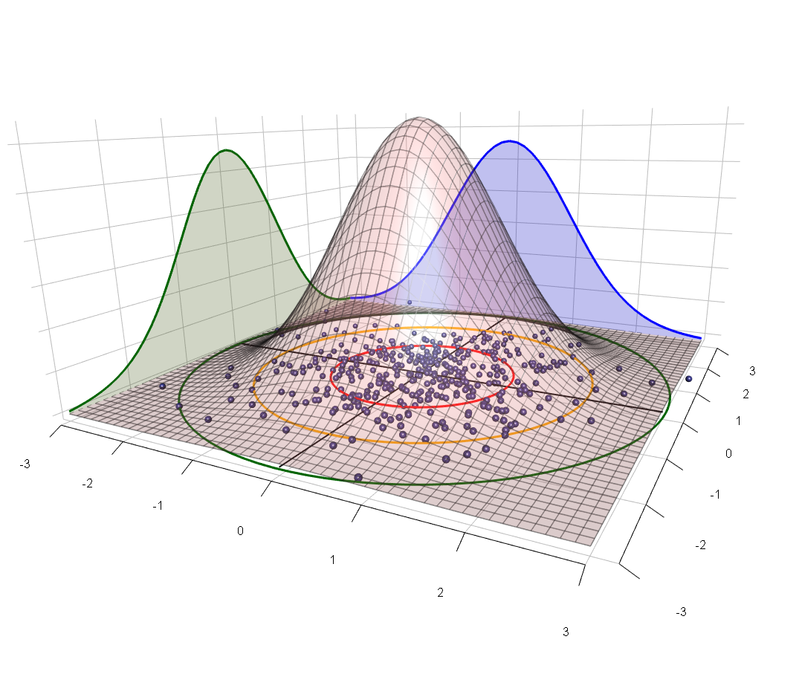

```{r setup, include=FALSE}
library(rgl)
knitr::opts_chunk$set(webgl = hook_webgl,
                      echo = FALSE,
                      fig.align = 'center',
                      message =FALSE,
                      warning = FALSE
                      )
set.seed(0)

sigmoid <- function(x){
  1/(1+exp(-x))
}


write_matex2 <- function(x) {
  begin <- "\\begin{bmatrix}"
  end <- "\\end{bmatrix}"
  X <-
    apply(x, 1, function(x) {
      paste(
        paste(round(x,2), collapse = "&"),
        "\\\\"
      )
    })
  paste(c(begin, X, end), collapse = "")
}
```


## Some responses: geometry of ridge regression


::::::{.cols data-latex=""}


::: {.col data-latex="{0.30\textwidth}"}

```{r, out.width="100%", fig.asp=0.9}
library(plotrix)
library(latex2exp)
library(graphics)
par(mar=c(5,5,5,0.1)+.1)
plot(-2:5,seq(-2,5,by = 1),type="n",xlab=TeX("$\\beta_1$"),ylab=TeX("$\\beta_2$"), xlim=c(-1, 4),ylim=c(-2.5, 5.5), cex.axis=1, cex.lab=2.5)
 draw.circle(0,0,c(1,0.66,0.33),border="purple",
  col=c("palegreen3","palegreen2","palegreen"),lty=1,lwd=1)
 # draw.circle(2.5,8,0.6,border="red",lty=3,lwd=3)
 draw.circle(3,3,c(1.5,1,0.5), border="red",lty=1,
  angle=30,lwd=3)
 
 text(3, 3.5, TeX("$\\beta_{ML}$"), cex=3)
  # text(0, 0, TeX("$0$"), cex=3)
 arrows(0, 0, x1 = 3, y1 = 3, col = "black", lty=1, lwd=3)
 arrows(0, 0, x1 = 1.5, y1 = 1.5, col = "blue", lty=1, lwd=3)
 
  text(1.8, 0.8, TeX("$\\beta_{Ridge}$"), cex=3, col="blue")
  
  text(3, -0.5, "Likelihood", cex=3, col="red")
  text(0, -2.5, "penalty", cex=3, col="palegreen4")
 # draw.circle(3.5,8,0.8,border="blue",lty=2,lwd=2)
```
:::

::: {.col data-latex="{0.70\textwidth}"}

$$\vv{\beta}_{\text{ridge}} \equiv \argmin_{\vv{\beta}} \underbrace{||\vv{y}-\vv{X\beta}||_2^2}_{L(\vv{\theta})} + \lambda ||\vv{\beta}||_2^2$$ 
$$\vv{\beta}_{\text{ridge}} = (\vv{X}^T\vv{X} + \lambda \vv{I})^{-1}\vv{Xy}$$
  
  - assume feature vectors of $\vv{X}$ are norm 1 and orthogonal i.e. orthogonormal: $\vv{X}^T\vv{X} = \vv{I}$
  
  $$\footnotesize \vv{\beta}_{\text{ridge}} = \frac{1}{1+\lambda} (\vv{X}^T\vv{X})^{-1}\vv{Xy}= \frac{1}{1+\lambda}\vv{\beta}_{ML}$$
  
  - why the likelihood (red) contours are circular for this case ? \pause remember the Hessian of $L(\vv{\theta})$? $$\footnotesize H_{L} = 2\vv{X}^T\vv{X}\propto \vv{I}$$
  - uniform discount: $\beta_k$ receives the same discount:
  $\frac{1}{1+\lambda}$
  
:::
::::::


 
## Some responses: some other cases


::::::{.cols data-latex=""}

::: {.col data-latex="{0.30\textwidth}"}

```{r, out.width="100%", fig.asp=1}
library(plotrix)
library(latex2exp)
library(graphics)
par(mar=c(5,5,5,0.1)+.1)
plot(-2:5,seq(-2,5,by = 1),type="n",xlab=TeX("$\\beta_1$"),ylab=TeX("$\\beta_2$"), xlim=c(-1, 4),ylim=c(-2.5, 5.5), cex.axis=1, cex.lab=2.5)
 draw.circle(0,0,c(1,0.66,0.33),border="purple",
  col=c("palegreen3","palegreen2","palegreen"),lty=1,lwd=1)
 # draw.circle(2.5,8,0.6,border="red",lty=3,lwd=3)
 # draw.circle(3,3,c(1.5,1,0.5), border="darkred", col=c("red3", "red2", "red") ,lty=1,
 #  angle=30,lwd=1)
 
draw.ellipse(c(3,3,3),c(3,3,3), c(1, 2,3), c(0.5, 1,1.5), border="red", lwd=3)
 
 text(3, 3.5, TeX("$\\beta_{ML}$"), cex=3)
  # text(0, 0, TeX("$0$"), cex=3)
 arrows(0, 0, x1 = 3, y1 = 3, col = "black", lty=1, lwd=3)
 arrows(0, 0, x1 = 0.5, y1 = 2.8, col = "blue", lty=1, lwd=3)
 
  text(0.5, 3.2, TeX("$\\beta_{Ridge}$"), cex=3, col="blue")
  
  text(3, 1.2, "Likelihood", cex=3, col="red")
  text(0, -2.5, "penalty", cex=3, col="palegreen4")
 # draw.circle(3.5,8,0.8,border="blue",lty=2,lwd=2)
```
:::


::: {.col data-latex="{0.7\textwidth}"}

When $H_L \neq \vv{I}$ , the shrinkage is **NOT** uniform; 
  
  $${\beta}^{\text{ridge}}_k = \frac{\sigma_k}{{\sigma_k}+\lambda} {\beta}^{ML}_k\;\;\;$$

  - $\sigma_k$ is the directional curvature of $\vv{X}^T\vv{X}$ (also the eigen value)
  - flat curve ($\beta_1$ direction) $\Rightarrow$ $\sigma_k$ smaller $\Rightarrow$ more discount
  - curvy curve ($\beta_2$ direction) $\Rightarrow$ $\sigma_k$ larger $\Rightarrow$ less discount 
  - makes perfect sense!
    - flat means less confident (or large variance): shrink more
    - peak means confident estimate (small variance): shrink less


\footnotesize $(*)$ the equation is true when $\vv{X}^T\vv{X}$ is a diagonal matrix; up to basis translation for more general cases

:::
::::::


## Today's topic

Unsupervised learning 

  - clustering
  - k-means

Revisit multivariate Gaussian

Revisit k-means

  - mixture of Gaussians 
  - EM algorithm for mixture model
    - K-means is just a specific case
  - other kinds of mixture models
  


## Unsupervised learning 


## Clustering 


## K-means


## K-means


## Demonstration


## Limitations of K-means 


## Dissect multivariate Gaussians 

```{=latex}

\tikzstyle{every picture}+=[remember picture]
\everymath{\displaystyle}
\tikzstyle{na} = [baseline=-.5ex]

\begin{equation*}
p(\vv{x})={N}(\vv{x}; \vv{\mu}, \vv{\Sigma}) \equiv \tikz[baseline]{  \node[fill=blue!20,anchor=base] (t1) {$\frac{1}{(2\pi)^{d/2} |\vv{\Sigma}|^{1/2}}$};}
\tikz[baseline] {\node[fill=purple!10, circle, anchor=base] (t2) {$\exp$}; }   [\tikz[baseline] {\node[fill=green!80!black, anchor=base] (t3){$-$};}\frac{1}{2} 
\underbrace{\tikz[baseline]{\node[fill=red!20, anchor=base] (t4) {$(\vv{x} -\vv{\mu})^T\vv{\Sigma}^{-1}(\vv{x}-\vv{\mu})$};} }_{d_{\vv{\Sigma}}}
 ]
\end{equation*}


\begin{columns}
\begin{column}{0.7\textwidth}\footnotesize
\begin{itemize}[<+->]
    \item \textcolor{red!80}{a distance measure \tikz\node [coordinate] (qf) {};}:(aka mahalanobis distance) $$d_{\vv{\Sigma}}(\vv{x};\vv{\mu}): \text{between }\vv{x}\text{ and } \vv{\mu}$$
    \item \textcolor{green!80!black}{$-$}\tikz\node [coordinate] (neg) {};: $p$ is \textcolor{green!80!black}{\textbf{negatively}} related to the distance
        $$\text{larger } d_{\vv{\Sigma}}(\vv{x};\vv{\mu} ) \Rightarrow \text{further away }\vv{x} \text{ from } \vv{\mu} \Rightarrow  \text{smaller } p$$
    \item \textcolor{purple!80}{$\exp$}: \tikz\node [coordinate] (exp) {}; makes sure $p(\vv{x})>0$
       
    \item \textcolor{blue!80}{normalising\tikz\node [coordinate] (n3) {}; constant}: s.t. $\int N(\vv{x};\cdot, \cdot) d\vv{x} = 1$; $$|\vv{\Sigma}|: \text{ determinant; a volume measure-ish quantity}$$
\end{itemize}


\begin{tikzpicture}[overlay]
        \path[->]<1-> (qf) edge [bend left, red!80] (t4);
        \path[->]<2-> (neg) edge [bend right, green!80!black] (t3);
        \path[->]<3-> (exp) edge [bend right, purple!80!black] (t2);
        \path[->]<4-> (n3) edge [bend right, blue!80] (t1);
\end{tikzpicture}
\end{column}
\begin{column}{0.35\textwidth}
\begin{figure}
    \centering
    \includegraphics[width = 1\textwidth]{./figs/2dMVN1}
 % \caption{}
\end{figure}  
\end{column}
\end{columns}
```


## Dissect multivariate Gaussians

**Key message**: $d_{\Sigma}$ (the distance) determines equal $p(\vv{x})$ levels

\begin{equation*}\footnotesize
p(\vv{x}) \equiv \underbrace{\tikz[baseline]{  \node[fill=blue!20,anchor=base] (t1) {$\frac{1}{(2\pi)^{d/2} |\vv{\Sigma}|^{1/2}}$};}}_{C: \text{normalising cst.}}
\overbrace{\tikz[baseline] {\node[fill=purple!10, circle, anchor=base] (t2) {$\exp$}; }   [\overbrace{\tikz[baseline] {\node[fill=green!50, anchor=base] (t3){$-$};}\frac{1}{2} 
\underbrace{\tikz[baseline]{\node[fill=red!20, anchor=base] (t4) {$(\vv{x} -\vv{\mu})^T\vv{\Sigma}^{-1}(\vv{x}-\vv{\mu})$};}}_{f_1=d_{\vv{\Sigma}}(\vv{x};\vv{\mu})}}^{f_2}
 ]}^{f_3}
\end{equation*}

::::::{.cols data-latex=""}

::: {.col data-latex="{0.25\textwidth}"}
```{r,  out.height="30%"}
knitr::include_graphics("./figs/2dMVNQF0.eps")
```

\footnotesize
  1. a distance measure: $f_1(\vv{x})=d_{\vv{\Sigma}}(\vv{x};\vv{\mu})$
:::

::: {.col data-latex="{0.25\textwidth}"}
```{r, out.height="30%"}
knitr::include_graphics("./figs/2dnegMVNQF0.eps")
```
\footnotesize
2. negated distance: $f_2(\vv{x})=-\frac{1}{2}f_1(\vv{x})$
<!-- =-\frac{1}{2} \cdot d_{\vv{\Sigma}}(\vv{x};\vv{\mu})$ -->
:::

::: {.col data-latex="{0.25\textwidth}"}
```{r, out.height="30%"}
knitr::include_graphics("./figs/2dExpNegMVNQF0.eps")
```
\footnotesize
 3. exp. to make sure $p>0$: $f_3(\vv{x})=e^{f_2(\vv{x})}$
 
 <!-- =\exp( -1/2 \cdot d_{\vv{\Sigma}}(\vv{x};\vv{\mu}))$ -->
:::

::: {.col data-latex="{0.25\textwidth}"}
```{r, out.height="30%"}
knitr::include_graphics("./figs/2dMVN1.eps")
```
\footnotesize
4. scaled to make sure $\int p(\vv{x})d\vv{x}=1$: $p(\vv{x})= C\cdot f_3(\vv{x})$

<!-- =C\cdot \exp(-1/2 d_{\vv{\Sigma}}(\vv{x};\vv{\mu}))$ -->
:::
::::::


 
  
 
  

<!-- ## Multivariate Gaussian: an example -->


<!-- ::::::{.cols data-latex=""} -->

<!-- ::: {.col data-latex="{0.60\textwidth}"} -->

<!-- \begin{align*}\footnotesize -->
<!-- p(\vv{x}) &= \frac{1}{(2\pi)^{d/2} |\vv{\Sigma}|^{1/2}}\cdot \\ -->
<!--  &\;\;\; {\exp}\left[ - 1/2\cdot  -->
<!-- \underbrace{\tikz[baseline]{\node[fill=red!20, anchor=base] (t4) {$(\vv{x} -\vv{\mu})^T\vv{\Sigma}^{-1}(\vv{x}-\vv{\mu})$};}}_{d_{\vv{\Sigma}}} -->
<!-- \right ] -->
<!-- \end{align*} -->

<!--   - when $\vv{\Sigma} = \vv{I}$ and $\vv{\mu}=\vv{0}$  -->
<!--   - $d_{\vv{I}}(\vv{x}, \vv{0})= x_1^2+x_2^2$ is Eclidean distance: circular contour in $x_1 \times x_2$ plane -->
<!--   - and $p(\vv{x}) = p(x_1)p(x_2)$ -->

<!--     - i.e. indepedence   -->
<!--     - $p(x_1)$ is a univariate Gaussian with mean $\mu_1=0$ and $\sigma_1^2 = I_{11} =1$ -->
<!--     - $p(x_2)$ is the same -->


<!-- ::: -->

<!-- ::: {.col data-latex="{0.40\textwidth}"} -->

<!-- ```{r, out.width="100%"} -->
<!--  -->
<!-- ``` -->

<!-- ::: -->

<!-- :::::: -->


## Covariance matrix and distance

$$\vv{\Sigma}: \text{ variance-covariance matrix}$$

  - $d\times d$ symmetric matrix:
  $$\vv{\Sigma}= \vv{\Sigma}^T$$
  - positive definite (P.D.): 
  $$\vv{v}^T\vv{\Sigma} \vv{v} >0,\;\;\; \forall \vv{v} \in R^d$$
  - why P.D. ? distance has to be positive ! (similar to univariate Gaussian: $(x-\mu)^2\cdot\sigma^{-2}>0$)
  $$(\vv{x}-\vv{\mu})^T \vv{\Sigma}^{-1} (\vv{x}-\vv{\mu}) >0, \;\;\;\text{where } \vv{v} = \vv{x}-\vv{\mu}$$
    - if $\vv{\Sigma}$ is P.D., then $\vv{\Sigma}^{-1}$ is also P.D.; so the above is a valid distance metric

\footnotesize

Proof: 
Let $\vv{y} = \vv{\Sigma}\vv{v}$; then $\vv{y}^T\vv{\Sigma}^{-1}\vv{y} = \vv{v}^T\vv{\Sigma}^T\vv{\Sigma}^{-1}\vv{\Sigma}\vv{v} = \vv{v}^T\vv{\Sigma}^T\vv{v} =\vv{v}^T\vv{\Sigma}\vv{v}> 0$


## Diagonal $\vv{\Sigma}$: implies independence

If $$\footnotesize \vv{\Sigma} = \begin{bmatrix}\sigma_1^2 & 0 & \ldots & 0 \\ 0 &\sigma^2_2 & \ldots & 0 \\ \vdots & \vdots & \ddots & \vdots \\ 0 & 0 & \ldots & \sigma^2_d  \end{bmatrix};\;\;\;\vv{\Sigma}^{-1} = \begin{bmatrix}\frac{1}{\sigma_1^2} & 0 & \ldots & 0 \\ 0 &\frac{1}{\sigma^2_2} & \ldots & 0 \\ \vdots & \vdots & \ddots & \vdots \\ 0 & 0 & \ldots & \frac{1}{\sigma^2_d}  \end{bmatrix}$$
Then 
\footnotesize 
\begin{align*} p(\vv{x}) &=  \frac{1}{(2\pi)^{d/2} |\vv{\Sigma}|^{1/2}} \exp\{-\frac{1}{2}
(\vv{x} -\vv{\mu})^T\vv{\Sigma}^{-1}(\vv{x}-\vv{\mu})\} =\frac{1}{(2\pi)^{d/2} (\prod_{i=1}^d \sigma_i^2)^{1/2}} \exp \{-\frac{1}{2} \sum_{i=1}^d (x_i-\mu_i)^2/\sigma_i^2\} \\
&= \prod_{i=1}^d \underbrace{\frac{1}{(2\pi)^{1/2} \sigma_i} \exp \{-\frac{1}{2} (x_i-\mu_i)^2/\sigma_i^2 \}}_{\text{unvariate Gaussian}} =\underbrace{ \prod_{i=1}^d p(x_i)}_{
\text{independence !}}
\end{align*}

and each $p(x_i) = N(x_i; \mu_i, \sigma^2_i)$ is a univariate Gaussian 

Remember independence ? \colorbox{red!20}{it means knowing one does not inform the other: $p(x_i|\vv{x}_{/i})=p(x_i)$}


## Diagonal $\vv{\Sigma}$: axis aligned ellipses

$$\vv{\Sigma} = \begin{bmatrix}\sigma_1^2 & 0 \\ 0 & \sigma_2^2 \end{bmatrix};\vv{\Sigma}^{-1} = \begin{bmatrix}\frac{1}{\sigma_1^2} & 0 \\ 0 & \frac{1}{\sigma_2^2} \end{bmatrix}\;\;\; \text{so }d_{\vv{\Sigma}}(\vv{x}; \vv{0}) \text{ are axis aligned ellipses}$$

::::::{.cols data-latex=""}

::: {.col data-latex="{0.25\textwidth}"}

```{r, fig.asp=1, out.width="90%"}
library(mvtnorm)
# par(mfrow=c(2,2))
par(mar=c(5,5,5,.1)+.1)
# load("./data/lec9_nonlinear_class.RData")
# plot(xx[y==0, 1], xx[y==0, 2], pch=8, col="blue", xlim=c(min(xx[,1])-0.5, max(xx[,1])+0.5), ylim=c(min(xx[,2])-0.5, max(xx[,2])+0.5), xlab=expression(x[1]), ylab=expression(x[2]), cex=5, cex.lab=2.5, cex.axis=2)
# points(xx[y==1, 1], xx[y==1, 2], pch=1, col="red", cex=5)

# tmpd<-poly(xx, degree=1)
mu<- c(0,0)
Sigma <- diag(1, nrow=2)

level99 <- (2*pi)^{-1}*det(Sigma)^{-1/2}*exp(-1/2*(3^2))
level95 <- (2*pi)^{-1}*det(Sigma)^{-1/2}*exp(-1/2*(2^2))
level90 <- (2*pi)^{-1}*det(Sigma)^{-1/2}*exp(-1/2*1)
# dat_<-data.frame(y=y, X=xx)

# fit_tmp<-glm(y~.+0, data=dat_, family = "binomial")
# fit_tmp<-glm(y~. ,data.frame(X=xx, y=y), family = "binomial")
gridlines <-500
x.pred <- seq(-4.5, 4.5, length.out = gridlines)
y.pred <- seq(-4.5, 4.5, length.out = gridlines)
xy <- expand.grid(x = x.pred, y = y.pred)
colnames(xy) <-NULL
# z.pred <- matrix(predict(fit_tmp, newdata = data.frame(X=(xy)), type="response"), 
                 # nrow = gridlines, ncol = gridlines)

samples <- rmvnorm(1000, mean=mu, sigma=Sigma)
z.pred <- matrix(dmvnorm(xy, mean=mu, sigma=Sigma), nrow=gridlines, ncol=gridlines)
contour(x=x.pred, y=y.pred, z=z.pred, levels = c(level90, level95, level99), xlab=expression(x[1]), ylab=expression(x[2]), cex.lab=3, cex.axis=2,labels = c(".5", "0.95", "0.99"),
        col="blue", drawlabels=T, lwd=4, labcex=3.5)
points(samples[, 1], samples[, 2], pch=20, col="red", cex=1)
# points(xx[y==1, 1], xx[y==1, 2], pch=2, col="blue", cex=1)
```

$$\vv{\Sigma} = \begin{bmatrix}1 & 0 \\ 0 & 1 \end{bmatrix}$$


:::


::: {.col data-latex="{0.25\textwidth}"}

```{r, fig.asp=1, out.width="90%"}
library(mvtnorm)
# par(mfrow=c(2,2))
par(mar=c(5,5,5,.1)+.1)
# load("./data/lec9_nonlinear_class.RData")
# plot(xx[y==0, 1], xx[y==0, 2], pch=8, col="blue", xlim=c(min(xx[,1])-0.5, max(xx[,1])+0.5), ylim=c(min(xx[,2])-0.5, max(xx[,2])+0.5), xlab=expression(x[1]), ylab=expression(x[2]), cex=5, cex.lab=2.5, cex.axis=2)
# points(xx[y==1, 1], xx[y==1, 2], pch=1, col="red", cex=5)

# tmpd<-poly(xx, degree=1)
mu<- c(0,0)
Sigma <- diag(3, nrow=2)

level99 <- (2*pi)^{-1}*det(Sigma)^{-1/2}*exp(-1/2*(3^2))
level95 <- (2*pi)^{-1}*det(Sigma)^{-1/2}*exp(-1/2*(2^2))
level90 <- (2*pi)^{-1}*det(Sigma)^{-1/2}*exp(-1/2*1)
# dat_<-data.frame(y=y, X=xx)

# fit_tmp<-glm(y~.+0, data=dat_, family = "binomial")
# fit_tmp<-glm(y~. ,data.frame(X=xx, y=y), family = "binomial")
gridlines <-500
x.pred <- seq(-4.5, 4.5, length.out = gridlines)
y.pred <- seq(-4.5, 4.5, length.out = gridlines)
xy <- expand.grid(x = x.pred, y = y.pred)
colnames(xy) <-NULL
# z.pred <- matrix(predict(fit_tmp, newdata = data.frame(X=(xy)), type="response"), 
                 # nrow = gridlines, ncol = gridlines)

samples <- rmvnorm(1000, mean=mu, sigma=Sigma)
z.pred <- matrix(dmvnorm(xy, mean=mu, sigma=Sigma), nrow=gridlines, ncol=gridlines)
contour(x=x.pred, y=y.pred, z=z.pred, levels = c(level90, level95, level99), xlab=expression(x[1]), ylab=expression(x[2]), cex.lab=3, cex.axis=2,labels = c(".5", "0.95", "0.99"),
        col="blue", drawlabels=T, lwd=5, labcex = 3)
points(samples[, 1], samples[, 2], pch=20, col="red", cex=1)
# points(xx[y==1, 1], xx[y==1, 2], pch=2, col="blue", cex=1)
```

$$\vv{\Sigma} = \begin{bmatrix}3 & 0 \\ 0 & 3 \end{bmatrix}$$


:::

::: {.col data-latex="{0.25\textwidth}"}

```{r, fig.asp=1, out.width="90%"}
library(mvtnorm)
# par(mfrow=c(2,2))
par(mar=c(5,5,5,3)+.1)
# load("./data/lec9_nonlinear_class.RData")
# plot(xx[y==0, 1], xx[y==0, 2], pch=8, col="blue", xlim=c(min(xx[,1])-0.5, max(xx[,1])+0.5), ylim=c(min(xx[,2])-0.5, max(xx[,2])+0.5), xlab=expression(x[1]), ylab=expression(x[2]), cex=5, cex.lab=2.5, cex.axis=2)
# points(xx[y==1, 1], xx[y==1, 2], pch=1, col="red", cex=5)

# tmpd<-poly(xx, degree=1)
mu<- c(0,0)
Sigma <- diag(c(1,2), nrow=2)

level99 <- (2*pi)^{-1}*det(Sigma)^{-1/2}*exp(-1/2*(3^2))
level95 <- (2*pi)^{-1}*det(Sigma)^{-1/2}*exp(-1/2*(2^2))
level90 <- (2*pi)^{-1}*det(Sigma)^{-1/2}*exp(-1/2*1)
# dat_<-data.frame(y=y, X=xx)

# fit_tmp<-glm(y~.+0, data=dat_, family = "binomial")
# fit_tmp<-glm(y~. ,data.frame(X=xx, y=y), family = "binomial")
gridlines <-500
x.pred <- seq(-4.5, 4.5, length.out = gridlines)
y.pred <- seq(-4.5, 4.5, length.out = gridlines)
xy <- expand.grid(x = x.pred, y = y.pred)
colnames(xy) <-NULL
# z.pred <- matrix(predict(fit_tmp, newdata = data.frame(X=(xy)), type="response"), 
                 # nrow = gridlines, ncol = gridlines)

samples <- rmvnorm(1000, mean=mu, sigma=Sigma)
z.pred <- matrix(dmvnorm(xy, mean=mu, sigma=Sigma), nrow=gridlines, ncol=gridlines)
contour(x=x.pred, y=y.pred, z=z.pred, levels = c(level90, level95, level99), xlab=expression(x[1]), ylab=expression(x[2]), cex.lab=3, cex.axis=2,labels = c(".5", "0.95", "0.99"),
        col="blue", drawlabels=T, lwd=4, labcex=3.5)
points(samples[, 1], samples[, 2], pch=20, col="red", cex=1)
# points(xx[y==1, 1], xx[y==1, 2], pch=2, col="blue", cex=1)
```

$$\vv{\Sigma} = \begin{bmatrix}1 & 0 \\ 0 & 2 \end{bmatrix}$$
:::

::: {.col data-latex="{0.25\textwidth}"}

```{r, fig.asp=1, out.width="90%"}
# par(mfrow=c(2,2))
par(mar=c(5,5,5,.1)+.1)
# load("./data/lec9_nonlinear_class.RData")
# plot(xx[y==0, 1], xx[y==0, 2], pch=8, col="blue", xlim=c(min(xx[,1])-0.5, max(xx[,1])+0.5), ylim=c(min(xx[,2])-0.5, max(xx[,2])+0.5), xlab=expression(x[1]), ylab=expression(x[2]), cex=5, cex.lab=2.5, cex.axis=2)
# points(xx[y==1, 1], xx[y==1, 2], pch=1, col="red", cex=5)

# tmpd<-poly(xx, degree=1)
mu<- c(0,0)
Sigma <- diag(c(2,1), nrow=2)

level99 <- (2*pi)^{-1}*det(Sigma)^{-1/2}*exp(-1/2*(3^2))
level95 <- (2*pi)^{-1}*det(Sigma)^{-1/2}*exp(-1/2*(2^2))
level90 <- (2*pi)^{-1}*det(Sigma)^{-1/2}*exp(-1/2*1)
# dat_<-data.frame(y=y, X=xx)

# fit_tmp<-glm(y~.+0, data=dat_, family = "binomial")
# fit_tmp<-glm(y~. ,data.frame(X=xx, y=y), family = "binomial")
gridlines <-500
x.pred <- seq(-4.5, 4.5, length.out = gridlines)
y.pred <- seq(-4.5, 4.5, length.out = gridlines)
xy <- expand.grid(x = x.pred, y = y.pred)
colnames(xy) <-NULL
# z.pred <- matrix(predict(fit_tmp, newdata = data.frame(X=(xy)), type="response"), 
                 # nrow = gridlines, ncol = gridlines)

samples <- rmvnorm(1000, mean=mu, sigma=Sigma)
z.pred <- matrix(dmvnorm(xy, mean=mu, sigma=Sigma), nrow=gridlines, ncol=gridlines)
contour(x=x.pred, y=y.pred, z=z.pred, levels = c(level90, level95, level99), xlab=expression(x[1]), ylab=expression(x[2]), cex.lab=3, cex.axis=2,labels = c(".5", "0.95", "0.99"),
        col="blue", drawlabels=T, lwd=4, labcex=3.5)
points(samples[, 1], samples[, 2], pch=20, col="red", cex=1)
# points(xx[y==1, 1], xx[y==1, 2], pch=2, col="blue", cex=1)
```

$$\vv{\Sigma} = \begin{bmatrix}2 & 0 \\ 0 & 1 \end{bmatrix}$$
:::

::::::


## General $\vv{\Sigma}$: rotated ellipses

$$\vv{\Sigma} = \begin{bmatrix}\sigma_1^2 & \sigma_{12} \\ \sigma_{21} & \sigma_2^2 \end{bmatrix}\;\;\; \text{ }d_{\vv{\Sigma}}(\vv{x}; \vv{0}) \text{ are rotated ellipses}$$

::::::{.cols data-latex=""}

::: {.col data-latex="{0.25\textwidth}"}

```{r, fig.asp=1, out.width="90%"}
library(mvtnorm)
# par(mfrow=c(2,2))
par(mar=c(5,5,5,.1)+.1)
# load("./data/lec9_nonlinear_class.RData")
# plot(xx[y==0, 1], xx[y==0, 2], pch=8, col="blue", xlim=c(min(xx[,1])-0.5, max(xx[,1])+0.5), ylim=c(min(xx[,2])-0.5, max(xx[,2])+0.5), xlab=expression(x[1]), ylab=expression(x[2]), cex=5, cex.lab=2.5, cex.axis=2)
# points(xx[y==1, 1], xx[y==1, 2], pch=1, col="red", cex=5)

# tmpd<-poly(xx, degree=1)
mu<- c(0,0)
Sigma <- matrix(c(1,0.4, 0.4, 1), nrow=2)

level99 <- (2*pi)^{-1}*det(Sigma)^{-1/2}*exp(-1/2*(3^2))
level95 <- (2*pi)^{-1}*det(Sigma)^{-1/2}*exp(-1/2*(2^2))
level90 <- (2*pi)^{-1}*det(Sigma)^{-1/2}*exp(-1/2*1)
# dat_<-data.frame(y=y, X=xx)

# fit_tmp<-glm(y~.+0, data=dat_, family = "binomial")
# fit_tmp<-glm(y~. ,data.frame(X=xx, y=y), family = "binomial")
gridlines <-500
x.pred <- seq(-4.5, 4.5, length.out = gridlines)
y.pred <- seq(-4.5, 4.5, length.out = gridlines)
xy <- expand.grid(x = x.pred, y = y.pred)
colnames(xy) <-NULL
# z.pred <- matrix(predict(fit_tmp, newdata = data.frame(X=(xy)), type="response"), 
                 # nrow = gridlines, ncol = gridlines)

samples <- rmvnorm(1000, mean=mu, sigma=Sigma)
z.pred <- matrix(dmvnorm(xy, mean=mu, sigma=Sigma), nrow=gridlines, ncol=gridlines)
contour(x=x.pred, y=y.pred, z=z.pred, levels = c(level90, level95, level99), xlab=expression(x[1]), ylab=expression(x[2]), cex.lab=3, cex.axis=2,labels = c(".5", "0.95", "0.99"),
        col="blue", drawlabels=T, lwd=4, labcex=3.5)
points(samples[, 1], samples[, 2], pch=20, col="red", cex=1)
# points(xx[y==1, 1], xx[y==1, 2], pch=2, col="blue", cex=1)
```

$$\vv{\Sigma} = \begin{bmatrix}1 & 0.4 \\ 0.4 & 1 \end{bmatrix}$$


:::


::: {.col data-latex="{0.25\textwidth}"}

```{r, fig.asp=1, out.width="90%"}
library(mvtnorm)
# par(mfrow=c(2,2))
par(mar=c(5,5,5,.1)+.1)
# load("./data/lec9_nonlinear_class.RData")
# plot(xx[y==0, 1], xx[y==0, 2], pch=8, col="blue", xlim=c(min(xx[,1])-0.5, max(xx[,1])+0.5), ylim=c(min(xx[,2])-0.5, max(xx[,2])+0.5), xlab=expression(x[1]), ylab=expression(x[2]), cex=5, cex.lab=2.5, cex.axis=2)
# points(xx[y==1, 1], xx[y==1, 2], pch=1, col="red", cex=5)

# tmpd<-poly(xx, degree=1)
mu<- c(0,0)
Sigma <- matrix(c(1,0.9,0.9,1), nrow=2)

level99 <- (2*pi)^{-1}*det(Sigma)^{-1/2}*exp(-1/2*(3^2))
level95 <- (2*pi)^{-1}*det(Sigma)^{-1/2}*exp(-1/2*(2^2))
level90 <- (2*pi)^{-1}*det(Sigma)^{-1/2}*exp(-1/2*1)
# dat_<-data.frame(y=y, X=xx)

# fit_tmp<-glm(y~.+0, data=dat_, family = "binomial")
# fit_tmp<-glm(y~. ,data.frame(X=xx, y=y), family = "binomial")
gridlines <-500
x.pred <- seq(-4.5, 4.5, length.out = gridlines)
y.pred <- seq(-4.5, 4.5, length.out = gridlines)
xy <- expand.grid(x = x.pred, y = y.pred)
colnames(xy) <-NULL
# z.pred <- matrix(predict(fit_tmp, newdata = data.frame(X=(xy)), type="response"), 
                 # nrow = gridlines, ncol = gridlines)

samples <- rmvnorm(1000, mean=mu, sigma=Sigma)
z.pred <- matrix(dmvnorm(xy, mean=mu, sigma=Sigma), nrow=gridlines, ncol=gridlines)
contour(x=x.pred, y=y.pred, z=z.pred, levels = c(level90, level95, level99), xlab=expression(x[1]), ylab=expression(x[2]), cex.lab=3, cex.axis=2,labels = c(".5", "0.95", "0.99"),
        col="blue", drawlabels=T, lwd=4, labcex=3.5)
points(samples[, 1], samples[, 2], pch=20, col="red", cex=1)
# points(xx[y==1, 1], xx[y==1, 2], pch=2, col="blue", cex=1)
```

$$\vv{\Sigma} = \begin{bmatrix}1 & 0.9 \\ 0.9 & 1 \end{bmatrix}$$


:::

::: {.col data-latex="{0.25\textwidth}"}

```{r, fig.asp=1, out.width="90%"}
library(mvtnorm)
# par(mfrow=c(2,2))
par(mar=c(5,5,5,3)+.1)
# load("./data/lec9_nonlinear_class.RData")
# plot(xx[y==0, 1], xx[y==0, 2], pch=8, col="blue", xlim=c(min(xx[,1])-0.5, max(xx[,1])+0.5), ylim=c(min(xx[,2])-0.5, max(xx[,2])+0.5), xlab=expression(x[1]), ylab=expression(x[2]), cex=5, cex.lab=2.5, cex.axis=2)
# points(xx[y==1, 1], xx[y==1, 2], pch=1, col="red", cex=5)

# tmpd<-poly(xx, degree=1)
mu<- c(0,0)
Sigma <- matrix(c(1,-0.4, -0.4, 1), nrow=2)

level99 <- (2*pi)^{-1}*det(Sigma)^{-1/2}*exp(-1/2*(3^2))
level95 <- (2*pi)^{-1}*det(Sigma)^{-1/2}*exp(-1/2*(2^2))
level90 <- (2*pi)^{-1}*det(Sigma)^{-1/2}*exp(-1/2*1)
# dat_<-data.frame(y=y, X=xx)

# fit_tmp<-glm(y~.+0, data=dat_, family = "binomial")
# fit_tmp<-glm(y~. ,data.frame(X=xx, y=y), family = "binomial")
gridlines <-500
x.pred <- seq(-4.5, 4.5, length.out = gridlines)
y.pred <- seq(-4.5, 4.5, length.out = gridlines)
xy <- expand.grid(x = x.pred, y = y.pred)
colnames(xy) <-NULL
# z.pred <- matrix(predict(fit_tmp, newdata = data.frame(X=(xy)), type="response"), 
                 # nrow = gridlines, ncol = gridlines)

samples <- rmvnorm(1000, mean=mu, sigma=Sigma)
z.pred <- matrix(dmvnorm(xy, mean=mu, sigma=Sigma), nrow=gridlines, ncol=gridlines)
contour(x=x.pred, y=y.pred, z=z.pred, levels = c(level90, level95, level99), xlab=expression(x[1]), ylab=expression(x[2]), cex.lab=3, cex.axis=2,labels = c(".5", "0.95", "0.99"),
        col="blue", drawlabels=T, lwd=4, labcex=3.5)
points(samples[, 1], samples[, 2], pch=20, col="red", cex=1)
# points(xx[y==1, 1], xx[y==1, 2], pch=2, col="blue", cex=1)
```

$$\vv{\Sigma} = \begin{bmatrix}1 & -0.4 \\ -0.4 & 1 \end{bmatrix}$$
:::

::: {.col data-latex="{0.25\textwidth}"}

```{r, fig.asp=1, out.width="90%"}
# par(mfrow=c(2,2))
par(mar=c(5,5,5,.1)+.1)
# load("./data/lec9_nonlinear_class.RData")
# plot(xx[y==0, 1], xx[y==0, 2], pch=8, col="blue", xlim=c(min(xx[,1])-0.5, max(xx[,1])+0.5), ylim=c(min(xx[,2])-0.5, max(xx[,2])+0.5), xlab=expression(x[1]), ylab=expression(x[2]), cex=5, cex.lab=2.5, cex.axis=2)
# points(xx[y==1, 1], xx[y==1, 2], pch=1, col="red", cex=5)

# tmpd<-poly(xx, degree=1)
mu<- c(0,0)
Sigma <- matrix(c(1,-0.8, -0.8, 1), nrow=2)

level99 <- (2*pi)^{-1}*det(Sigma)^{-1/2}*exp(-1/2*(3^2))
level95 <- (2*pi)^{-1}*det(Sigma)^{-1/2}*exp(-1/2*(2^2))
level90 <- (2*pi)^{-1}*det(Sigma)^{-1/2}*exp(-1/2*1)
# dat_<-data.frame(y=y, X=xx)

# fit_tmp<-glm(y~.+0, data=dat_, family = "binomial")
# fit_tmp<-glm(y~. ,data.frame(X=xx, y=y), family = "binomial")
gridlines <-500
x.pred <- seq(-4.5, 4.5, length.out = gridlines)
y.pred <- seq(-4.5, 4.5, length.out = gridlines)
xy <- expand.grid(x = x.pred, y = y.pred)
colnames(xy) <-NULL
# z.pred <- matrix(predict(fit_tmp, newdata = data.frame(X=(xy)), type="response"), 
                 # nrow = gridlines, ncol = gridlines)

samples <- rmvnorm(1000, mean=mu, sigma=Sigma)
z.pred <- matrix(dmvnorm(xy, mean=mu, sigma=Sigma), nrow=gridlines, ncol=gridlines)
contour(x=x.pred, y=y.pred, z=z.pred, levels = c(level90, level95, level99), xlab=expression(x[1]), ylab=expression(x[2]), cex.lab=3, cex.axis=2,labels = c(".5", "0.95", "0.99"),
        col="blue", drawlabels=T, lwd=4, labcex=3.5)
points(samples[, 1], samples[, 2], pch=20, col="red", cex=1)
# points(xx[y==1, 1], xx[y==1, 2], pch=2, col="blue", cex=1)
```

$$\vv{\Sigma} = \begin{bmatrix}1 & -0.9 \\ -0.9 & 1 \end{bmatrix}$$
:::

::::::


## MLE of multivariate Gaussian

Given $\{\Di{x}{1}, \Di{x}{2}, \ldots, \Di{x}{m}\}$, assume $\Di{x}{i} \sim N(\vv{\mu},\vv{\Sigma})$; the goal is to estimate 

$$\footnotesize \vv{\mu},\; \vv{\Sigma}$$

The log likelihood is:

$$\footnotesize \mathcal{L}(\vv{\mu}, \vv{\Sigma}) =  \log P(\{\Di{x}{i}\}_1^m|\vv{\mu}, \vv{\Sigma}) = \sum_{i=1}^m \log N(\Di{x}{i}; \vv{\mu}, \vv{\Sigma})$$

The MLE is defined as usual:

$$\footnotesize \vv{\mu}_{ML},\vv{\Sigma}_{ML} = \argmax_{\vv{\mu}, \vv{\Sigma}} \mathcal{L}(\vv{\mu}, \vv{\Sigma})$$

Take derivative and set to zero; after some tedious steps, the solution is:

\begin{equation*}
\tikz[baseline]{  \node[fill=blue!20,anchor=base] (t1) {$\vv{\mu}_{ML} = \frac{1}{m} \sum_{i=1}^m \Di{x}{i},\;\;\; \vv{\Sigma}_{ML}= \frac{1}{m} \sum_{i=1}^m (\Di{x}{i}-\vv{\mu}_{ML})(\Di{x}{i}-\vv{\mu}_{ML})^T$};}
\end{equation*}


## Example: MLE of MV Gaussian

True parameters: $\footnotesize \vv{\mu}=[1,1]^T,\;\;\; \vv{\Sigma}= \begin{bmatrix} 1& 0.6\\ 0.6& 2\end{bmatrix}$

  - \colorbox{red!20}{MLE is \textbf{consistent}: it converges to the truth with enough data}
  
::::::{.cols data-latex=""}

::: {.col data-latex="{0.25\textwidth}"}

```{r, fig.asp=1, out.width="90%"}

library(mvtnorm)
# par(mfrow=c(2,2))
par(mar=c(5,5,5,.1)+.1)
# load("./data/lec9_nonlinear_class.RData")
# plot(xx[y==0, 1], xx[y==0, 2], pch=8, col="blue", xlim=c(min(xx[,1])-0.5, max(xx[,1])+0.5), ylim=c(min(xx[,2])-0.5, max(xx[,2])+0.5), xlab=expression(x[1]), ylab=expression(x[2]), cex=5, cex.lab=2.5, cex.axis=2)
# points(xx[y==1, 1], xx[y==1, 2], pch=1, col="red", cex=5)

# tmpd<-poly(xx, degree=1)
mu<- c(1,1)
Sigma <- matrix(c(1,0.6,0.6,2), nrow=2)

level99 <- (2*pi)^{-1}*det(Sigma)^{-1/2}*exp(-1/2*(3^2))
level95 <- (2*pi)^{-1}*det(Sigma)^{-1/2}*exp(-1/2*(2^2))
level90 <- (2*pi)^{-1}*det(Sigma)^{-1/2}*exp(-1/2*1)
# dat_<-data.frame(y=y, X=xx)

# fit_tmp<-glm(y~.+0, data=dat_, family = "binomial")
# fit_tmp<-glm(y~. ,data.frame(X=xx, y=y), family = "binomial")
gridlines <-500
x.pred <- seq(mu[1]-4.5, mu[1]+4.5, length.out = gridlines)
y.pred <- seq(mu[2]-4.5, mu[2]+4.5, length.out = gridlines)
xy <- expand.grid(x = x.pred, y = y.pred)
colnames(xy) <-NULL
# z.pred <- matrix(predict(fit_tmp, newdata = data.frame(X=(xy)), type="response"), 
                 # nrow = gridlines, ncol = gridlines)
mm<-10
samples <- rmvnorm(mm, mean=mu, sigma=Sigma)
z.pred <- matrix(dmvnorm(xy, mean=mu, sigma=Sigma), nrow=gridlines, ncol=gridlines)
contour(x=x.pred, y=y.pred, z=z.pred, levels = c(level99), xlab=expression(x[1]), ylab=expression(x[2]), cex.lab=3, cex.axis=2,labels = c("0.99"),
        col="blue", drawlabels=T, lwd=4, labcex=3.5)
points(samples[, 1], samples[, 2], pch=20, col="red", cex=1)

muML = colMeans(samples)
e = sweep(samples, 2, colMeans(samples))
sigmaML=t(e)%*%e /mm
# points(xx[y==1, 1], xx[y==1, 2], pch=2, col="blue", cex=1)

```
$\centering \footnotesize \text{(sample size)}: `r paste(mm)`$
\begin{eqnarray*}
\footnotesize
\vv{\mu}_{ML}= [`r paste(round(muML[1],2))`, `r paste(round(muML[2],2))`]^T\\
\footnotesize\vv{\Sigma}_{ML}=`r write_matex2(sigmaML)`
\end{eqnarray*}
:::

::: {.col data-latex="{0.25\textwidth}"}


```{r, fig.asp=1, out.width="90%"}
# par(mfrow=c(2,2))
par(mar=c(5,5,5,.1)+.1)
# load("./data/lec9_nonlinear_class.RData")
# plot(xx[y==0, 1], xx[y==0, 2], pch=8, col="blue", xlim=c(min(xx[,1])-0.5, max(xx[,1])+0.5), ylim=c(min(xx[,2])-0.5, max(xx[,2])+0.5), xlab=expression(x[1]), ylab=expression(x[2]), cex=5, cex.lab=2.5, cex.axis=2)
# points(xx[y==1, 1], xx[y==1, 2], pch=1, col="red", cex=5)

# tmpd<-poly(xx, degree=1)
mu<- c(1,1)
Sigma <- matrix(c(1,0.6,0.6,2), nrow=2)

# level99 <- (2*pi)^{-1}*det(Sigma)^{-1/2}*exp(-1/2*(3^2))
# level95 <- (2*pi)^{-1}*det(Sigma)^{-1/2}*exp(-1/2*(2^2))
# level90 <- (2*pi)^{-1}*det(Sigma)^{-1/2}*exp(-1/2*1)
# dat_<-data.frame(y=y, X=xx)

# fit_tmp<-glm(y~.+0, data=dat_, family = "binomial")
# fit_tmp<-glm(y~. ,data.frame(X=xx, y=y), family = "binomial")
gridlines <-500
x.pred <- seq(mu[1]-4.5, mu[1]+4.5, length.out = gridlines)
y.pred <- seq(mu[2]-4.5, mu[2]+4.5, length.out = gridlines)
xy <- expand.grid(x = x.pred, y = y.pred)
colnames(xy) <-NULL
# z.pred <- matrix(predict(fit_tmp, newdata = data.frame(X=(xy)), type="response"), 
                 # nrow = gridlines, ncol = gridlines)
mm<-50
samples <- rmvnorm(mm, mean=mu, sigma=Sigma)
z.pred <- matrix(dmvnorm(xy, mean=mu, sigma=Sigma), nrow=gridlines, ncol=gridlines)
contour(x=x.pred, y=y.pred, z=z.pred, levels = c(level99), xlab=expression(x[1]), ylab=expression(x[2]), cex.lab=3, cex.axis=2,labels = c("0.99"),
        col="blue", drawlabels=T, lwd=4, labcex=3.5)
points(samples[, 1], samples[, 2], pch=20, col="red", cex=1)

muML = colMeans(samples)
e = sweep(samples, 2, colMeans(samples))
sigmaML=t(e)%*%e /mm
# points(xx[y==1, 1], xx[y==1, 2], pch=2, col="blue", cex=1)
```

$\centering \footnotesize \text{(sample size)}: `r paste(mm)`$
\begin{eqnarray*}
\footnotesize
\vv{\mu}_{ML}= [`r paste(round(muML[1],2))`, `r paste(round(muML[2],2))`]^T\\
\footnotesize\vv{\Sigma}_{ML}=`r write_matex2(sigmaML)`
\end{eqnarray*}

:::

::: {.col data-latex="{0.25\textwidth}"}


```{r, fig.asp=1, out.width="90%"}
# par(mfrow=c(2,2))
par(mar=c(5,5,5,.1)+.1)
# load("./data/lec9_nonlinear_class.RData")
# plot(xx[y==0, 1], xx[y==0, 2], pch=8, col="blue", xlim=c(min(xx[,1])-0.5, max(xx[,1])+0.5), ylim=c(min(xx[,2])-0.5, max(xx[,2])+0.5), xlab=expression(x[1]), ylab=expression(x[2]), cex=5, cex.lab=2.5, cex.axis=2)
# points(xx[y==1, 1], xx[y==1, 2], pch=1, col="red", cex=5)

# tmpd<-poly(xx, degree=1)
mu<- c(1,1)
Sigma <- matrix(c(1,0.6,0.6,2), nrow=2)

# level99 <- (2*pi)^{-1}*det(Sigma)^{-1/2}*exp(-1/2*(3^2))
# level95 <- (2*pi)^{-1}*det(Sigma)^{-1/2}*exp(-1/2*(2^2))
# level90 <- (2*pi)^{-1}*det(Sigma)^{-1/2}*exp(-1/2*1)
# dat_<-data.frame(y=y, X=xx)

# fit_tmp<-glm(y~.+0, data=dat_, family = "binomial")
# fit_tmp<-glm(y~. ,data.frame(X=xx, y=y), family = "binomial")
gridlines <-500
x.pred <- seq(mu[1]-4.5, mu[1]+4.5, length.out = gridlines)
y.pred <- seq(mu[2]-4.5, mu[2]+4.5, length.out = gridlines)
xy <- expand.grid(x = x.pred, y = y.pred)
colnames(xy) <-NULL
# z.pred <- matrix(predict(fit_tmp, newdata = data.frame(X=(xy)), type="response"), 
                 # nrow = gridlines, ncol = gridlines)
mm<-100
samples <- rmvnorm(mm, mean=mu, sigma=Sigma)
z.pred <- matrix(dmvnorm(xy, mean=mu, sigma=Sigma), nrow=gridlines, ncol=gridlines)
contour(x=x.pred, y=y.pred, z=z.pred, levels = c(level99), xlab=expression(x[1]), ylab=expression(x[2]), cex.lab=3, cex.axis=2,labels = c("0.99"),
        col="blue", drawlabels=T, lwd=4, labcex=3.5)
points(samples[, 1], samples[, 2], pch=20, col="red", cex=1)

muML = colMeans(samples)
e = sweep(samples, 2, colMeans(samples))
sigmaML=t(e)%*%e /mm
# points(xx[y==1, 1], xx[y==1, 2], pch=2, col="blue", cex=1)
```
$\centering \footnotesize \text{(sample size)}: `r paste(mm)`$
\begin{eqnarray*}
\footnotesize
\vv{\mu}_{ML}= [`r paste(round(muML[1],2))`, `r paste(round(muML[2],2))`]^T\\
\footnotesize\vv{\Sigma}_{ML}=`r write_matex2(sigmaML)`
\end{eqnarray*}

:::


::: {.col data-latex="{0.25\textwidth}"}


```{r, fig.asp=1, out.width="90%"}
# par(mfrow=c(2,2))
par(mar=c(5,5,5,.1)+.1)
# load("./data/lec9_nonlinear_class.RData")
# plot(xx[y==0, 1], xx[y==0, 2], pch=8, col="blue", xlim=c(min(xx[,1])-0.5, max(xx[,1])+0.5), ylim=c(min(xx[,2])-0.5, max(xx[,2])+0.5), xlab=expression(x[1]), ylab=expression(x[2]), cex=5, cex.lab=2.5, cex.axis=2)
# points(xx[y==1, 1], xx[y==1, 2], pch=1, col="red", cex=5)

# tmpd<-poly(xx, degree=1)
mu<- c(1,1)
Sigma <- matrix(c(1,0.6,0.6,2), nrow=2)

# level99 <- (2*pi)^{-1}*det(Sigma)^{-1/2}*exp(-1/2*(3^2))
# level95 <- (2*pi)^{-1}*det(Sigma)^{-1/2}*exp(-1/2*(2^2))
# level90 <- (2*pi)^{-1}*det(Sigma)^{-1/2}*exp(-1/2*1)
# dat_<-data.frame(y=y, X=xx)

# fit_tmp<-glm(y~.+0, data=dat_, family = "binomial")
# fit_tmp<-glm(y~. ,data.frame(X=xx, y=y), family = "binomial")
gridlines <-500
x.pred <- seq(mu[1]-4.5, mu[1]+4.5, length.out = gridlines)
y.pred <- seq(mu[2]-4.5, mu[2]+4.5, length.out = gridlines)
xy <- expand.grid(x = x.pred, y = y.pred)
colnames(xy) <-NULL
# z.pred <- matrix(predict(fit_tmp, newdata = data.frame(X=(xy)), type="response"), 
                 # nrow = gridlines, ncol = gridlines)
mm<-5000
samples <- rmvnorm(mm, mean=mu, sigma=Sigma)
z.pred <- matrix(dmvnorm(xy, mean=mu, sigma=Sigma), nrow=gridlines, ncol=gridlines)
contour(x=x.pred, y=y.pred, z=z.pred, levels = c(level99), xlab=expression(x[1]), ylab=expression(x[2]), cex.lab=3, cex.axis=2,labels = c("0.99"),
        col="blue", drawlabels=T, lwd=4, labcex=3.5)
points(samples[, 1], samples[, 2], pch=20, col="red", cex=1)

muML = colMeans(samples)
e = sweep(samples, 2, colMeans(samples))
sigmaML=t(e)%*%e /mm
# points(xx[y==1, 1], xx[y==1, 2], pch=2, col="blue", cex=1)
```
$\centering \footnotesize \text{(sample size)}: `r paste(mm)`$
\begin{eqnarray*}
\footnotesize
\vv{\mu}_{ML}= [`r paste(round(muML[1],2))`, `r paste(round(muML[2],2))`]^T\\
\footnotesize\vv{\Sigma}_{ML}=`r write_matex2(sigmaML)`
\end{eqnarray*}

:::
::::::
## Finite mixture model


## EM for mixture of Gaussians 


## Revisit K-means 


## Demonstration

## How to decide $K$


## EM for general mixture

## EM as a general algorithm

## Review: expectation

**Expection** of a r.v. is defined as 
$$\E{g(X)} = \sum_x g(x) P(x) \text{ or } \E{g(X)} = \int g(x) P(x)dx$$
  
- $\E{a} = a$ ($a$ is a constant)
- linearity: $\E{aX +bY}  = a\E{X} + b\E{Y}$
- $\E{\E{X}} = \E{X}$: as $\E{X}$ is a constant (the randomness has been integrated out)

\bigskip 

Interpretation of Expectation: sample mean of a very large sample

$$\E{g(X)} = \frac{1}{m} \sum_{i=1}^m g(\di{x}{i});\;\;\; m\rightarrow \infty$$

  - limit of the sample average of $\{\di{x}{1}, \ldots, \di{x}{m}\}$ and $\di{x}{i} \sim P(X)$
  
  
  
## Review: varaiance covariance

**Variance** of a r.v. is defined as
$$\Var{g(X)} = \E{(g(X)-\E{g(X)})^2}= \E{g(X)^2} -\E{g(X)}^2$$ 

- $\Var{aX} = a^2\Var{X}$
- measures the spread of the distribution around the mean $\E{g(X)}$


\only<article>{A very useful identity that links expectation and variance together is 
\[\Var{x} = \E{x^2} - \E{x}^2 , \] which can be proved as follows:
\[ \Var{x} = \E{x^2 -2\E{x} x + \E{x}^2} = \E{x^2} -2\E{x}^2 + \E{x}^2 = \E{x^2} - \E{x}^2; \]
 the second equality holds because $\E{x}=\mu$  is a constant. Note that $\E{x^2}$ is called the \textit{second moment} of r.v. $x$.}


## Example

$X$ is a Bernoulli r.v. with parameter $p=0.5$; what is $\E{X}$?

- $\E{X} = 1\times P(X=1) + 0\times P(X=0) = p =0.5$;

\bigskip

$Y$ is a Binomial r.v. with $N=10, p=0.5$, what is $\E{Y}$?

- $Y= \sum_{i=1}^{N} X = N\times X$
- $\E{Y} = \E{N\times X} = N\times \E{X} = N\times p = 5$
- interpretation: you expect to see 5 successes out of 10 (on average the result is 5 if you repeat the experiment a lot of times)

