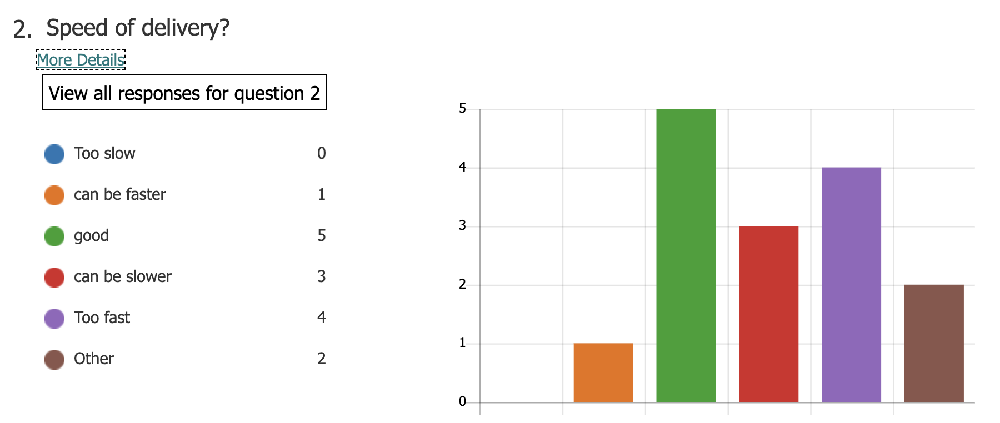
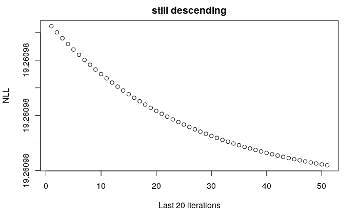

```{r setup, include=FALSE}
library(rgl)
knitr::opts_chunk$set(webgl = hook_webgl,
                      echo = FALSE,
                      fig.align = 'center',
                      message =FALSE,
                      warning = FALSE
                      )
set.seed(0)

```


# Introduction

## Poll last time


```{r, out.width="65%"}


```


## Maths 

Do I need to read all the maths on the slides \textit{during lecture} ?

  - \textbf{NO}! follow the logic is more important
  - \textit{esp.} when I jump slides (most likely technical details)
    - e.g. "take the derivative and set it to zero", just believe me for the time being
    - might left there for your reference (I will make sure it is clear)
  - catch the key message
    - the conclusion: e.g. $MLE$ leads to least square

BUT \textbf{YES} verify them after the lecture step by step 
  
  - no way to learn CS or maths modules just by attending lectures

Feel free to stop me during the lecture

  - when you cannot follow the logic: highly likely I have messed something up
  - when the notation is confusing: still possibly my bad
    - I used $\sigma$ for both sigmoid and variance ($\sigma^2$) of Gaussian
    - or like $\prod p_i^{I(x=i)}$, if you do not know what $I$ does..
    
## Do I need to do the derivations?

Yes and no.
  
  - No; not a maths module \textit{per se}
  - Yes; to get a 20/20, we expect you to 
    - know the details 
    - solve noval problems (derive algorithms based on some unseen models)

\bigskip

Take gradients for example

  - not a big deal if you mess up a gradient derivation
  - but **very problematic** if you *after taking this module*
    - do not know what gradient does 
    - do not know e.g. $f: R^n\rightarrow R$'s derivative is a $n$-element vector 
    - do not know gradient is actually a function (it returns a direction given a "location")
  - less problematic if you 
    - do not know how to solve the problem if you mess it up (debug)
    
## Speed of delivery


  - I will slow down a bit
  - will not cut down any material though
  - cover as much as we can in one hour
  - provide extra video clips for missing slides
    - or parts need more examples 
    - polls at the end
  

## Recap

Maximum likelihood estimation (MLE): $$\theta_{ML} = \argmax_{\theta} \underbrace{\log P(\mathcal{D}|\theta)}_{\mathcal{L(\theta)}}$$

  - $\mathcal{L}(\theta)$: log likelihood function
  - $\theta_{ML}$: maximum likelihood estimator

\bigskip

Two key results

  - Gaussian likelihood $\Leftrightarrow$ Loss for regression (squared error loss)
  - Bernoulli likelihood $\Leftrightarrow$ Loss for binary classification (cross-entropy loss)
  
\bigskip


\begin{tcolorbox}[colback=green!5,colframe=green!40!black,title=The moral of the story:]
\centering \empha{(negative) Log likelihoods are loss functions (with some nice properties)}
\end{tcolorbox}


## Topics of today 

Logistic regression

  - closer look at the loss function
  - gradients of logistic regression
  - stochastic gradient descent
  
\bigskip

Newton's method

  - another optimisation algorithm
  - converge faster than gradient descent (theoretically)

\bigskip

MLE's asymptotic distribution (pre-recorded video clip)

  - $\theta_{ML}$ is actually a random variable
  - $\theta_{ML} \sim N(\theta, I_n^{-1})$


## Logistic regression

\begin{columns}
\begin{column}{0.75\textwidth}
Classification problem: $\di{y}{i} \in \{0,1\}$, predictors $\Di{x}{i} \in R^n$

The model: $$P(\di{y}{i} =1|\Di{x}{i},\vv{\theta}) = \sigma(\vv{\theta}^T\Di{x}{i}), \;\;\;P(\di{y}{i} =0|\Di{x}{i},\vv{\theta}) = 1-\sigma(\vv{\theta}^T\Di{x}{i})$$ which can be written as (why?) 

$$P(\di{y}{i}|\Di{x}{i},\vv{\theta}) = \sigma(\cdot)^{\dd{y}}(1-\sigma(\cdot))^{1-\dd{y}}.$$


The log likelihood function is 
\begin{align*}\mathcal{L}(\vv{\theta}) =  \log \prod_{i=1}^m P(\dd{y}|\vv{\theta}, \Di{x}{i})=\sum_{i=1}^m  \dd{y} \log \sigma^{(i)}+(1-\dd{y}) \log(1-\sigma^{(i)}) \end{align*}

\small shorthand notation: $\dd{\sigma} \equiv \sigma(\vv{\theta}^T\dd{\vv{x}})$; superscript with brackets, $(i)$: index of observations
\end{column}


\begin{column}{0.25\textwidth}
```{r, out.width='100%', fig.asp=0.8}
par(mar=c(5,5,3,0.1)+.1)
xx <- seq(-5, 5, by = 0.01)
plot(xx, pracma::sigmoid(xx), type="l", lwd =4, xlab = expression(paste(theta^T,"x")), ylim=c(0,1), ylab = "Sigmoid", col="red", cex.lab=3, cex.main=3, cex.axis=2)
# curve(1/(1+exp(-1*x)), from =-8, to =8, xlab = "x", ylab = "Sigmoid", col="red", cex.lab=2, cex.main=2, cex.axis=2)
```

\end{column}
\end{columns}


## Example


Let's consider a 1-d example

  - blue 'o' are negative: $\dd{y} = 0$
  - red '+' are positive: $\dd{y}=1$ 
  - with $P(\dd{y}=1) = \sigma(\theta_1x^{(i)} +\theta_0)$ in mind
  - learning: how to draw such a \textit{sigmoid} curve?
  
  \bigskip
  
```{r, out.width="50%"}
x_1 <- rnorm(100, -5, sd=4)
x_2 <- rnorm(100, 2, sd=4)
y_1 <- rep(0, length(x_1))
y_2 <- rep(1, length(x_2))
plot(x_1[1:50], y=rep(0, 50), ylim=c(-0.1,1.1), xlim=c(-15, 13), pch= 1, col ="blue", cex=4, xlab="x", ylab="y", cex.lab=2)
points(x_2, y = rep(1, 100), pch = 3, cex=4, col="red")
```

---

The negative log-likelihood $-\mathcal{L}$ provides a measure of fit

  - maximise $\mathcal{L}$ is the same as minimise $-\mathcal{L}$
  - loss function for classification
  - smaller the better

\vspace{0.4cm}  

```{r, fig.asp=0.45, out.height= "70%"}
par(mfrow=c(1,3)) 
par(mar=c(5,5,5,0.1)+.1)
x_1 <- rnorm(100, -5, sd=4)
x_2 <- rnorm(100, 3, sd=3)
y_1 <- rep(0, length(x_1))
y_2 <- rep(1, length(x_2))
nll <- function(x, y, mod){
  a<- mod[1]
  b<- mod[2]
  score <- a*x+b
  p <- pracma::sigmoid(score)
  -1*sum(y*log(p) + (1-y)*(log(1-p)))
}
x<- c(x_1, x_2)
y<-c(y_1, y_2)
mod1<- c(1, -5)
mod2<- c(2, 3)
mod3<- c(0.3, 0)
nll1<-nll(x, y, mod1)
nll2 <-nll(x, y, mod2)
nll3<-nll(x, y, mod3)

plot(x_1[1:50], y=rep(0, 50), ylim=c(-0.1,1.1), xlim=c(-15, 13), pch= 1, col ="blue", cex=2, xlab="x", ylab="y",
     main=(paste( "L=", round(nll1, digits = 2))), cex.main=3, cex.lab=3)
points(x_2, y = rep(1, 100), pch = 3, cex=2, col="red")
xx <- seq(-15,12, by=0.01)
lines(xx, pracma::sigmoid(xx, a=mod1[1], b=mod1[2]), col="purple", lwd=2)

plot(x_1[1:50], y=rep(0, 50), ylim=c(-0.1,1.1), xlim=c(-15, 18), pch= 1, col ="blue", cex=2, xlab="x", ylab="y",
     main=(paste( "L=", round(nll2, digits = 2))), cex.main=3, cex.lab=3)
points(x_2, y = rep(1, 100), pch = 3, cex=2, col="red")
xx <- seq(-15,12, by=0.01)
lines(xx, pracma::sigmoid(xx, a=mod2[1], b=mod2[2]), col="purple", lwd=2)

plot(x_1[1:50], y=rep(0, 50), ylim=c(-0.1,1.1), xlim=c(-15, 13), pch= 1, col ="blue", cex=2, xlab="x", ylab="y",
     main=(paste( "L=", round(nll3, digits = 2))),cex.main=3, cex.lab=3)
points(x_2, y = rep(1, 100), pch = 3, cex=2, col="red")
xx <- seq(-15,12, by=0.01)
lines(xx, pracma::sigmoid(xx, a=mod3[1], b=mod3[2]), col="purple", lwd=2)
```

## Closer look at the loss

\begin{columns}

\begin{column}{0.65\textwidth}
Consider one data point $i$: $\dd{y},\Di{x}{i}$

\begin{itemize}
\item the negative log likelihood is
$$-\dd{l}=\dd{y} \log \sigma^{(i)} +(1-\dd{y})\log(1-\sigma^{(i)})$$

\item consider $\dd{y} = 1$, \textit{i.e.} positive case; we want the probability $$P(\dd{y}=1)=\sigma^{(i)}$$ big (or close to 1)
\end{itemize}
\end{column}

\begin{column}{0.35\textwidth}
```{r, fig.asp=0.95, out.width="100%"}
par(mar=c(5,5,5,0.1)+.1)
xx <- seq(0,1, by=0.01)
plot(xx, -log(xx), type="l", cex.lab=3, cex.axis=3,xlim=c(0,1), xlab="P(y_i is positive)", ylab = "Loss", lwd=5, col="red")
```
\end{column}
\end{columns}


## Even closer look at the loss


\begin{columns}
\begin{column}{0.6\textwidth}
Exponential cost/lost (left side of the red curve)


\begin{itemize}
\item penalise confident but wrong answers
\item is it a good thing ?
\begin{itemize}
\item it kinda makes sense
\item but also not: outliers ?
\item heavy influence by one data on the final model 
\end{itemize}
\end{itemize}
  
Flat curve on the right side
    
\begin{itemize}
\item $P=0.8,0.9,1.0$ the losses are similar
\item discourage over confident predictions
\end{itemize}

You can use \textcolor{blue}{squared error} actually

\begin{itemize}
\item called ``Brier score'' loss
\item can you tell any potential problem ?
\end{itemize}
\end{column}

\begin{column}{0.4\textwidth}
```{r, fig.asp=0.9, out.width="100%"}
par(mar=c(5,5,5,0.1)+.1)
xx <- seq(0,1, by=0.01)
plot(xx, -log(xx), type="l", cex.lab=3, cex.axis=3,xlim=c(0,1), xlab="P(y_i is positive)", ylab = "loss", lwd=5, col="red")
lines(xx, (xx-1)^2, lwd=5, lty=2, col="blue")
text(0.3, 0.5, "square error", cex=3, col="blue")
text(0.2, 3, "likelihood loss", cex=3, col="red")
```
\end{column}
\end{columns}


  
## Gradient descent of logistic regression

Let's talk about fitting that ``S'' shaped surface 

\bigskip
Objective: maximising the log likelihood 

\begin{align*}\vv{\theta}_{ML} &= \argmax_{\vv{\theta}} \mathcal{L}(\vv{\theta}) = \argmin_{{\vv{\theta}}}(-\mathcal{L}(\vv{\theta})) \\
&= \argmin_{{\vv{\theta}}} -\left(\sum_{i=1}^m  \dd{y} \log \sigma^{(i)}+(1-\dd{y}) \log (1-\sigma^{(i)})\right )\end{align*}

  - there is no closed-form solution to: $\nabla_{\vv{\theta}} \mathcal{L}(\vv{\theta}) =\vv{0}$
    - $\mathcal{L}$ is a nonlinear transformation of $\vv{\theta}$
    - but $-\mathcal{L}$ still convex: only one minimum
  - you should know what algorithm to use now
    - gradient descent
    
## Gradient descent

Let's do some derivative: $$\mathcal{L}(\vv{\theta}) =\left(\sum_{i=1}^m  \dd{y} \log \sigma^{(i)}+(1-\dd{y})\log(1-\sigma^{(i)})\right )$$

Note that $\sigma^{(i)} = \sigma(\vv{\theta}^T\Di{x}{i})$

Let's consider $i$th summand only:

$$\dd{l}(\vv{\theta}) = \dd{y} \log \sigma^{(i)}+(1-\dd{y})\log(1-\sigma^{(i)})$$

\begin{align*}
\nabla_{\vv{\theta}}\dd{l} = ? 
\end{align*}

The following identities might be useful: $\frac{d\sigma(x)}{dx} = \sigma(1-\sigma)$ and $\frac{\partial \vv{a}^T\vv{x}}{\vv{x}} = \vv{a}^T$

## Gradient of logistic regression


\begin{columns}

\begin{column}{0.5 \textwidth}
\begin{align*}
\nabla_{\vv{\theta}}\dd{l} &= \left (\dd{y} -\sigma^{(i)}\right ) \left (\Di{x}{i}\right )^T\\
\nabla_{\vv{\theta}}\mathcal{L} &= \sum_{i=1}^m\nabla_{\vv{\theta}}\dd{l} \\
&=\sum_{i=1}^m \left (\dd{y} -\sigma^{(i)}\right ) \left (\Di{x}{i}\right )^T\\
&=\left (\vv{y} - \sigma(\vv{X\theta})\right )^T\vv{X}
\end{align*}

\footnotesize
I am abusing the notation here: $\sigma$ is $R\rightarrow R$, cannot be applied to a vector input.
It means apply $\sigma$ to each element of $\vv{X\theta}$
\end{column}
\begin{column}{0.5 \textwidth}

\end{column}
\end{columns}


## Gradient of logistic regression


\begin{columns}
\begin{column}{0.5 \textwidth}
\begin{align*}
\nabla_{\vv{\theta}}\dd{l} &= \left (\dd{y} -\sigma^{(i)}\right ) \left (\Di{x}{i}\right )^T\\
\nabla_{\vv{\theta}}\mathcal{L} &= \sum_{i=1}^m\nabla_{\vv{\theta}}\dd{l} \\
&=\sum_{i=1}^m \left (\dd{y} -\sigma^{(i)}\right ) \left (\Di{x}{i}\right )^T\\
&=\left (\vv{y} - \sigma(\vv{X\theta})\right )^T\vv{X}
\end{align*}
\end{column}
\begin{column}{0.5 \textwidth}
\begin{algorithm}[H]
 initialise random $\vv{\theta}_0$\;
 \While{not converge}{
    $\vv{g}_t \leftarrow -\nabla_{\vv{\theta}}\mathcal{L}(\vv{\theta}_t)$\;
    $\vv{\theta}_{t+1} \leftarrow \vv{\theta}_{t} - \alpha\vv{g}_t $\;
 }
 \caption{Gradient descent}
\end{algorithm}

\bigskip 
\small
note $\vv{g}_t$ is the gradient of negative $\mathcal{L}$
so descending or mimising negative log likelihood
\end{column}
\end{columns}


## Connection to linear regression's gradient 

You should find the logistic gradient \empha{familiar}

$$\nabla_{\vv{\theta}}\mathcal{L} =\left (\vv{y} - \sigma(\vv{X\theta})\right )^T\vv{X}$$

Remember the gradient for linear regression ?
$$\nabla_{\vv{\theta}} L = -2(\vv{y}- \vv{X\theta})^T\vv{X}$$

  - "2" doesn't matter: $L$ could've been scaled to $\frac{1}{2}L$
  - "-" sign because we are maximising $\mathcal{L}$
  

Essentially it replaces the predictions $$\vv{X\theta}=[\vv{\theta}^T\Di{x}{1}, \vv{\theta}^T\Di{x}{1}, \ldots, \vv{\theta}^T\Di{x}{m}]^T$$ with the $\sigma$ transformed predictions $$\sigma(\vv{X\theta}) = [\sigma(\vv{\theta}^T\Di{x}{1}), \sigma(\vv{\theta}^T\Di{x}{1}), \ldots, \sigma(\vv{\theta}^T\Di{x}{m})]^T$$

\small *No coincidence: all Generalised Linear Models (GLMs) have the same gradient form

## Reminder for vector notation

$\vv{x}$ by default a column vector, therefore $\vv{x}^T$ means \textbf{row} vector

\bigskip

However, when I write out the elements of $\vv{x}$, one needs to write

$$\vv{x}=\begin{bmatrix}x_1\\x_2\\ \vdots\\ x_n \end{bmatrix},$$

which takes too much space in text, so you will usually see

$$\vv{x}=\overbrace{\underbrace{[x_1, x_2, \ldots, x_n}_{\text{row vector}}]^T}^{\text{column vector}}$$

Just to tell you $\vv{x}$ is still a column vector

## Stochastic gradient descent 


\begin{columns}
\begin{column}{0.5 \textwidth}
When data size is massive, gradients are expensive to calculate

  $$\nabla_{\vv{\theta}}\mathcal{L} = \sum_{i=1}^m\nabla_{\vv{\theta}}\dd{l}$$
  
\begin{itemize}
\item need to calculate $m$ gradients $\nabla_{\vv{\theta}}\dd{l}$
\item or not enough memory  
\item vector addition: adding directions together
\item SGD uses one of those directions instead
\item no longer steepest descent direction
\begin{itemize}
\item sometimes might ascent
\end{itemize}
\item still guarantee to converge
\end{itemize}

  
\end{column}

\begin{column}{0.5 \textwidth}
\pause
\begin{algorithm}[H]
 initialise random $\vv{\theta}_0$\;
 \While{not converge}{
    randomly permute data\;
    \For{i $\in 1\ldots m$}{
    $\vv{g}_t \leftarrow -\nabla_{\vv{\theta}}\dd{l}(\vv{\theta}_t)$\;
    $\vv{\theta}_{t+1} \leftarrow \vv{\theta}_{t} - \alpha\vv{g}_t $\;
    }
 }
 \caption{Stochastic gradient descent}
\end{algorithm}
\end{column}
\end{columns}


## Example gradient descent steps for logistic regression
```{r}
logisGrad <- function(y, X, theta){
  score <- X%*%theta
  mu<-pracma::sigmoid(score)
  return(t(X)%*%(y-mu))
}

logisNll <- function(y, X, theta){
  score <- X%*%theta
  p <- pracma::sigmoid(score)
  -1*sum(y*log(p) + (1-y)*(log(1-p)), na.rm=T)
}

logisticDescent <- function(alpha, iter, X, y, theta0){
  thetas <- matrix(0,nrow = ncol(X), ncol= iter+1)
  thetas[,1] <- theta <- theta0
  nll <- vector(mode = "numeric", length= iter+1)
  nll[1] <- logisNll(y,X, theta)
  for(i in 1:iter){
    g <- logisGrad(y, X, theta)
    thetas[,i+1] <- theta <- theta + alpha*g
    nll[i+1] <- logisNll(y,X, theta)
  }
  return(list(thetas, nll))
}


logisticSGD <- function(alpha, epoch, X, y, theta0, shuffle=T){
  iter <- epoch * nrow(X) 
  thetas <- matrix(0,nrow = ncol(X), ncol= iter+1)
  thetas[,1] <- theta <- theta0
  nll <- vector(mode = "numeric", length= iter+1)
  nll[1] <- logisNll(y, X, theta)
  index <- 1
  for(ep in 1:epoch){
    if (shuffle){
      rseq<-sample(1:nrow(X))
    }else{
      rseq<-1:nrow(X)
    }
    for(j in rseq){
      g <- logisGrad(y[j], X[j,, drop=F], theta)
      thetas[,index+1] <- theta <- theta + alpha*g
      nll[index+1] <- logisNll(y,X, theta)
      index<- index+1
    }
  }
  return(list(thetas, nll))
}

X <-  cbind(1, c(x_1, x_2))
y<- c(rep(0, length(x_1)), rep(1, length(x_2)))
theta0 <- c(1,1)
alpha <- 0.01
iter <- 500
```


```{r, fig.asp=0.45, out.height= "70%"}
par(mfrow=c(1,3)) 
par(mar=c(5,5,5,0.1)+.1)
theta0 <- c(0,0.1)
rstGD2 <- logisticDescent(alpha, iter, X, y, theta0)
i<-1
nll1 <- rstGD2[[2]][i]
plot(x_1[1:100], y=y[1:length(x_1)], ylim=c(-0.1,1.1), xlim=c(-15, 13), pch= 1, col ="blue", cex=2, xlab="Step 1", ylab="y",
     main=(paste( "L=", round(nll1, digits = 2))), cex.main=3, cex.lab=3)
points(x_2, y = y[(length(x_1)+1):length(y)], pch = 3, cex=2, col="red")
xx <- cbind(1,seq(-15,12, by=0.01))
p <- pracma::sigmoid( xx%*%t(t(rstGD2[[1]][1:2,i])))
lines(xx[,2], p, col="purple", lwd=2)
i<-2
nll2 <- rstGD2[[2]][i]
plot(x_1[1:50], y=rep(0, 50), ylim=c(-0.1,1.1), xlim=c(-15, 18), pch= 1, col ="blue", cex=2, xlab="Step 2", ylab="y",
     main=(paste( "L=", round(nll2, digits = 2))), cex.main=3, cex.lab=3)
points(x_2, y = rep(1, 100), pch = 3, cex=2, col="red")


p2 <- pracma::sigmoid( xx%*%t(t(rstGD2[[1]][1:2,i])))
# p2 <- pracma::sigmoid( xx%*%t(t(rstGD[[1]][1:2,2])))
lines(xx[,2], p2, col="purple", lwd=2)
i<-50
nll3 <- rstGD2[[2]][i]
plot(x_1[1:50], y=rep(0, 50), ylim=c(-0.1,1.1), xlim=c(-15, 13), pch= 1, col ="blue", cex=2, xlab="Step 50", ylab="y",
     main=(paste( "L=", round(nll3, digits = 2))),cex.main=3, cex.lab=3)
points(x_2, y = rep(1, 100), pch = 3, cex=2, col="red")


p3 <- pracma::sigmoid( xx%*%t(t(rstGD2[[1]][1:2,i])))
lines(xx[,2], p3, col="purple", lwd=2)
```

## Example: GD vs SGD

Compare Steepest Gradient Descent (GD) and Stochastic Gradient Descent (SGD)

  - note that SGD can go up
  - every step is no longer descent direction
  
\bigskip

```{r, fig.asp=0.5, out.height= "50%", cache=TRUE}

theta0 <- c(1,1)
alpha <- 0.01
iter <- 500
epoch <- 200
rstGD <- logisticDescent(alpha, iter, X, y, theta0)
rstSGD <- logisticSGD(alpha, epoch, X, y, theta0, shuffle = F)
rstSGD_RS <- logisticSGD(alpha, epoch, X, y, theta0, shuffle= T)
par(mfrow=c(1,2)) 
par(mar=c(5,5,3,3)+.1)
plot(rstGD[[2]][1:100], type="b", xlab="Steepest GD", ylab= "NLL", col="red" ,cex.lab= 2.5)
# plot(rstSGD[[2]][1:100], type="b", xlab="Stochastic GD", ylab= "NLL", cex.lab= 2.5)
plot(rstSGD_RS[[2]][1:100], type="b", xlab="Stochastic GD", ylab= "NLL", col="red" ,cex.lab= 2.5)
```

\small $NLL$ means negative log likelihood  

## Example: random shuffle SGD

Note that both converge at the end: $<68$ at the end like steepest GD

\bigskip

The nonshuffled SGD is pretty cyclic 
\bigskip
```{r, fig.asp=0.5, out.height= "50%", cache=TRUE}

par(mfrow=c(1,2)) 
par(mar=c(5,5,3,3)+.1)
plot(rstSGD[[2]][1:1500], type="l", xlab="SGD", ylab= "NLL", col="red" ,lwd=2, cex.lab= 2.5)
# plot(rstSGD[[2]][1:100], type="b", xlab="Stochastic GD", ylab= "NLL", cex.lab= 2.5)
plot(rstSGD_RS[[2]][1:1500], type="l", xlab="SGD with shuffle", ylab= "NLL",lwd=2,  col="red" ,cex.lab= 2.5)
```


## Newton's method: motivation

Gradient descent usually converges very slow at the end 

  - why though ?
  - what the gradient behaves like at the end ? destined to vanish  

```{r, out.width="40%"}

```

Solution: intuitively, we need to use the second derivative information

  - second derivative: measures curvature 
  - if it is flat (small curvature), take larger steps
  - otherwise, take smaller steps

## Newton's method: algorithm in words

Newton's method does exactly that

  - approximate $L$ by a quadratic function $T(\theta) = a\theta^2+b\theta+c$ or $$T(\vv{\theta})= \underbrace{\vv{\theta}^T\vv{A\theta}}_{\text{what is this?}} + \vv{b}^T\vv{\theta} +c$$
    - why quadratic ?
    - simpliest function with non-zero curvature
    - (hyperplanes have $0$ second derivative)
  - and optimise that approximation $T$ instead 
    - good news: quadratic functions have closed form solutions!
    $$\nabla_{\vv{\theta}} T = 2\vv{\theta}^T\vv{A} + \vv{b}^T =\vv{0} \Rightarrow  \vv{\theta}^\ast = -\vv{A}^{-1}\vv{b}$$
    - set the new location to $\vv{\theta}^{\ast}$
  - and repeat the above two steps until converge

\footnotesize $\vv{A}$ is assumed symmetric; it turns out all quadratic forms with asymmetric matricies can be massaged to this form

## An example: Newton steps

```{r, fig.asp=1.0,out.height= "85%"}
par(mfrow=c(2,1)) 

f3<- function(x){
  -x^3
}

f3p <- function(x){
  -3*x^2
}

f3pp <- function(x){
  -6*x
}

qf <- function(x0, x, FF=f3, FFp=f3p, FFpp=f3pp){
  return(FF(x0) + FFp(x0)*(x-x0) + FFpp(x0)/2*(x-x0)^2)
}


xs <- seq(-30, -1, by=0.1) 
plot(xs, f3(xs), type ="l", col="red", lwd=5, ylab=NA, xlab = expression(theta), cex=3, cex.lab=2)
x0<--25
lines(xs, qf(x0, xs), lty=3, col="blue", lwd=3)
segments(x0, f3(x0), x0, 0, lty = 2, lwd = 2)
x0_1 <- (-f3p(x0)/f3pp(x0)+x0)
text(x0_1, qf(x0, x0_1)+1500, expression(theta[1]), cex=2.5)
segments(x0_1, qf(x0, x0_1), x0_1, 0, lty = 2, lwd = 2)
text(x0, f3(x0)+2500,  expression(theta[0]), cex=2.5)

xs <- seq(-30, -1, by=0.1) 
plot(xs, f3(xs), type ="l", col="red", lwd=5, ylab=NA, xlab =  expression(theta), cex=3, cex.lab=2)
x0<--25
# lines(xs, qf(x0, xs), lty=3, col="blue", lwd=3)
# text(x0, f3(x0)+100, "x0", cex=2.5)
# segments(x0, f3(x0), x0, 0, lty = 2, lwd = 2)
x0_1 <- (-f3p(x0)/f3pp(x0)+x0)
text(x0_1, qf(x0, x0_1)+10, expression(theta[1]), cex=2.5)
segments(x0_1, f3(x0_1), x0_1, 0, lty = 2, lwd = 2)

lines(xs, qf(x0_1, xs), lty=3, col="blue", lwd=3)
x0_2 <- (-f3p(x0_1)/f3pp(x0_1)+x0_1)
text(x0_2, qf(x0_1, x0_2)+1500, expression(theta[2]), cex=2.5)
```
<!-- ## Another example: Newton steps -->

```{r, fig.asp=1,out.height= "90%", include=F}
par(mfrow=c(2,1)) 

ft <- function(x){
  return(x^2/2+5*log(1+exp(-x)))
}


fprime <- function(x){
  
  return(x-5*(exp(x)+1)^{-1})
}

fpp <- function(x){
  return(1+5*exp(x)*(exp(x)+1)^{-2})
}

qF <- function(x0, x){
  return(ft(x0) + fprime(x0)*(x-x0) + fpp(x0)/2*(x-x0)^2)
}


xs <- seq(-25, 25, by=0.1) 
plot(xs, ft(xs), type ="l", col="red", lwd=5, ylab=NA, xlab = "x", cex=3, cex.lab=2)
# x0<--20
# lines(xs, qf(x0, xs), lty=3, col="blue", lwd=3)
# text(x0, f3(x0)+100, "x0", cex=2.5)
# segments(x0, f3(x0), x0, 0, lty = 2, lwd = 2)
# x0_1 <- (-f3p(x0)/f3pp(x0)+x0)
# text(x0_1, qf(x0, x0_1), "x1", cex=2.5)
# segments(x0_1, qf(x0, x0_1), x0_1, 0, lty = 2, lwd = 2)


# xs <- seq(-30, -1, by=0.1) 
# plot(xs, f3(xs), type ="l", col="red", lwd=5, ylab=NA, xlab = "x", cex=3, cex.lab=2)
# x0<--25
# # lines(xs, qf(x0, xs), lty=3, col="blue", lwd=3)
# # text(x0, f3(x0)+100, "x0", cex=2.5)
# # segments(x0, f3(x0), x0, 0, lty = 2, lwd = 2)
# x0_1 <- (-f3p(x0)/f3pp(x0)+x0)
# text(x0_1, qf(x0, x0_1), "x1", cex=2.5)
# segments(x0_1, f3(x0_1), x0_1, 0, lty = 2, lwd = 2)
# 
# lines(xs, qf(x0_1, xs), lty=3, col="blue", lwd=3)
# x0_2 <- (-f3p(x0_1)/f3pp(x0_1)+x0_1)
# text(x0_2, qf(x0_1, x0_2), "x2", cex=2.5)
```
## Taylor's expansion

So how to find the approximation? Taylor's expansion:

 $$T(\vv{\theta}) = f(\vv{\theta}_t) + \underbrace{\vv{g}_t^{T}(\vv{\theta}-\vv{\theta}_t)}_{\text{linear}}  + \frac{1}{2!}\underbrace{ (\vv{\theta}-\vv{\theta}_t)^{T}\vv{H}_t(\vv{\theta}-\vv{\theta}_t)}_{\text{quadratic }}+\ldots,$$ 

  - where $\vv{g}_t=(\nabla_\theta f(\vv{\theta}_t))^T$ is the gradient of $f$ at $\vv{\theta}_t$ 
  - $\vv{H}$ is the Hessian matrix of $f$: second order derivative at $\vv{\theta}_t$
  - $T(\vv{\theta})$ (a quadratic function) approximates $f(\vv{\theta})$ at $\vv{\theta}_t$: exactly what we want
  
Last step: we need to optimise $T$ to find the next location $\vv{\theta}_{t+1}$ 

$$\nabla_{\vv{\theta}} T = \vv{g}_t^T + (\vv{\theta}-\vv{\theta}_t)^{T}\vv{H}_t = \vv{0}$$
$$\vv{\theta}^\ast = \vv{\theta}_t -\vv{H}_t^{-1}\vv{g}_t$$

## Newton's direction $\vv{d}_t$ vs gradient direction $\vv{g}_t$

This guy looks too familar to ignore

$$\vv{\theta} \leftarrow \vv{\theta}_t -\underbrace{\vv{H}_t^{-1}\vv{g}_t}_{\vv{d}_t}$$
  
Remember gradient descent step   

  $$\vv{\theta} \leftarrow \vv{\theta}_t -\alpha\vv{g}_t$$
  
  - $\vv{d}_t=\vv{H}_t^{-1}\vv{g}_t$ is a transformed gradient direction: Newton's direction
  - if $\vv{H}_t^{-1} = \vv{I}$, you recover the same update rule; can you see why ?
  - what if $\vv{H}_t$ is diagonal with different entries ? \textit{e.g.} $\vv{H}_t = \begin{bmatrix} 2& 0 \\ 0 &5\end{bmatrix}$

\footnotesize Moral of the story ? The steepest way now may not be optimal at the end. Maths is very philological indeed.


##

\begin{algorithm}[H]
 initialise random $\vv{\theta}_0$\;
 \While{not converge}{
    $\vv{g}_t \leftarrow -\nabla_{\vv{\theta}}{L}(\vv{\theta}_t)$\;
    $\vv{H}_t \leftarrow -\nabla^2_{\vv{\theta}}{L}(\vv{\theta}_t)$\;
    solve for Newton's direction: $\vv{H}_t\vv{d}_t = \vv{g}_t$\;
    $\vv{\theta}_{t+1} \leftarrow \vv{\theta}_{t} - \vv{d}_t $\;
 }
 \caption{Newton's Method}
\end{algorithm}
  
  
  - direct inverting $\vv{H}_t$ is expensive
  - less so if solve $\vv{H}_t\vv{d}_t = \vv{g}_t$
    - people call this Newton Conjugate Gradient method (Newton CG) (when conjugate gradient is used to solve the system of equations, and we will not discuss conjugate gradient method in this course).


## Newton's method for logistic regression

We need to find the Hessian $\vv{H}$ for the logistic log likelihood

\begin{align*}
\vv{H} &= \nabla_{\vv{\theta}}^2\mathcal{L} \\
&= \vv{X}^T\vv{D}\vv{X},
\end{align*}

where $$\vv{D} = \begin{bmatrix} \di{\sigma}{1}{(\di{\sigma}{1}-1)} & 0 & \ldots & 0\\
0 & \di{\sigma}{2}{(\di{\sigma}{2}-1)} & \ldots & 0 \\ 
\vdots & \vdots & \ddots & \vdots \\
0 & 0 & \ldots & \di{\sigma}{m}{(\di{\sigma}{m}-1)}
\end{bmatrix}$$

Together with the gradient, we have a Newton step.


## Next time

Practical issues on gradient and Newton like methods

  - tips on deriving gradients
  - how to spot errors
  - compare and contrast 

\bigskip

Non-linear models and regularisation 


## Bonus slides: Hessian for the likelihood of logistic regression
\footnotesize
Firstly, for a general function $f(x): R^n\rightarrow R$, the Hessian matrix of $f$ is defined as
$$\nabla_{x}^2f =\begin{bmatrix} \frac{\partial^2f}{\partial x_1^2}& \frac{\partial^2f}{\partial x_1\partial x_2}& \ldots& \frac{\partial^2f}{\partial x_1\partial x_n} \\
\frac{\partial^2f}{\partial x_2 \partial x_1}& \frac{\partial^2f}{\partial x_2^2}& \ldots& \frac{\partial^2f}{\partial x_2\partial x_n} \\
\vdots &\vdots & \ddots & \vdots \\
\frac{\partial^2f}{\partial x_n \partial x_1}& \frac{\partial^2f}{\partial x_n\partial x_2}& \ldots& \frac{\partial^2f}{\partial x_n^2} 
\end{bmatrix}$$

  - one key observation: it is symmetric as $\frac{\partial^2 f}{\partial x_ix_j} = \frac{\partial^2 f}{\partial x_jx_i}$

Example: $$f(\vv{x}) = 2x_1^2 + 4x_2^2$$

It's gradient is $\nabla_{\vv{x}} f = [\frac{\partial f}{\partial x_1}, \frac{\partial f}{\partial x_2}]=[4x_1, 8x_2]$; and by definition its Hessian is $$\vv{H} = \begin{bmatrix} \frac{\partial^2 f}{\partial x_1^2} & \frac{\partial f^2}{\partial x_1\partial x_2} \\
\frac{\partial^2 f}{\partial x_x\partial x_1} & \frac{\partial^2 f}{\partial x_2^2} \end{bmatrix} = \begin{bmatrix} 4 & 0 \\
0 & 8 \end{bmatrix}$$

##
\footnotesize
Like most maths concepts, definitions are fundamentally important but not very useful in practice. 

  - e.g. we don't calculate derivative by its limit definition

A more useful identity for Hessian is: it's a gradient of the gradient.

- like what we do in univariate calculus: find the derivative first and take the derivative again to find the second derivative. 
- so find $\nabla_{x}f$ first, then find the gradient of the gradient: $\nabla_{x}(\nabla_{x}f)$.
- the process involves applying the chain rule usually.

Example: $$f(\vv{x}) = 2x_1^2 + 4x_2^2 = \vv{x}^T \vv{M}\vv{x}, \text{ where } \vv{x}= [x_1, x_2]^T\;\;\vv{M} = \begin{bmatrix} 2 & 0\\ 0 & 4\end{bmatrix},$$

It's gradient is $\nabla_{\vv{x}} f = 2\vv{x}^T\vv{M}$;

Take derivative again: $\nabla_{\vv{x}} (\nabla_{\vv{x}}f) = 2\vv{M}^T= 2\vv{M}$, as $\vv{M}$ is symmetric. The results are the same but much simpler to obtain by using matrix derivative identities. 

We have used the following identities (useful identities can be found online, say wikipedia): 


$$\frac{\partial \vv{x}^T\vv{A}\vv{x}}{\partial \vv{x}} = 2\vv{x}^T\vv{A};\;\; \frac{\partial \vv{x}^T \vv{A}}{\partial \vv{x}} = \vv{A}^{T}$$


## 

\footnotesize 

Now let's tackle the Hessian for logistic regression's log likelihood

Remember the gradient is $$\nabla_{\vv{\theta}}\mathcal{L}= \left (\vv{y} - \sigma(\vv{X\theta})\right )^T\vv{X}$$

The useful matrix derivative identities for the calculation are listed below as a reference $$\frac{\partial \vv{x}^T\vv{A}}{\partial \vv{x}} = \vv{A}^T;\;\; \frac{\partial \vv{Ax}}{\partial \vv{x}} = \vv{A}.$$

To find the Hessian, take the gradient of $\nabla_{\vv{\theta}}\mathcal{L}$ again 

\begin{align*}\vv{H} &= \nabla_{\vv{\theta}}\nabla_{\vv{\theta}}\mathcal{L} = \nabla_{\vv{\theta}} \left( \left (\vv{y} - \sigma(\vv{X\theta})\right )^T\vv{X} \right)\\
&= \underbrace{\nabla_{\left (\vv{y} - \sigma(\vv{X\theta})\right )}\left (\left (\vv{y} - \sigma(\vv{X\theta})\right )^T\vv{X}\right)}_{X^T} \cdot  \underbrace{\nabla_{(\vv{X\theta})}\left (\vv{y} - \sigma(\vv{X\theta})\right )}_{D}\cdot \underbrace{\left (\nabla_{\vv{\theta}}\vv{X\theta}\right )}_{X} \\
&= \vv{X}^T \vv{DX}
\end{align*}

The second line has used the chain rule. The first term has used the first identity above; and the third term has used the second identity. You should convince yourself why.


The middle term is a Jacobian matrix actually, as the function transforms a vector to another vector (the gradient of a vector to vector function is a Jacobian matrix). Let's take a closer look. 

##
\footnotesize

Firstly, to make the notation less clutter, Let's denote $\vv{X\theta}\equiv \vv{\phi}$. Note that $\nabla_{(\vv{X\theta})}\left (\vv{y} - \sigma(\vv{X\theta})\right)\equiv \nabla_{\vv{\phi}}\left (\vv{y} - \sigma(\vv{\phi})\right) =- \nabla_{\vv{\phi}} \sigma(\vv{\phi})$ as $\vv{y}$ is a constant vector w.r.t the input $\vv{X\theta}$. The function we are considering here transforms $\vv{\phi}$ to $\sigma(\vv{\phi})$. The input is a $m\times 1$ ($m$ is number of data observations) element vector:

$$\vv{\phi}\equiv \vv{X\theta} = [\vv{\theta}^T\Di{x}{1}, \vv{\theta}^T\Di{x}{2}, \ldots, \vv{\theta}^T\Di{x}{m}]^T$$
The output of the function is a $m\times 1$ vector as well: 

$$\sigma(\vv{\phi}) \equiv \sigma(\vv{X\theta}) = [\sigma(\vv{\theta}^T\Di{x}{1}), \sigma(\vv{\theta}^T\Di{x}{2}),\ldots, \sigma(\vv{\theta}^T\Di{x}{m})]^T= [\di{\sigma}{1}, \di{\sigma}{2},\ldots, \di{\sigma}{m}]^T$$

Indeed it is $R^m\rightarrow R^m$ functions (vector to vector). 

Note that if we consider each scalar of the output vector, say $\di{\sigma}{i}$ it is a $R^m\rightarrow R$ function. 

E.g. the first entry of the output is a function with input $\vv{\phi}$ and output $\di{\sigma}{1}$ as
$$\di{\sigma}{1}(\vv{\phi})= 1\times \sigma({\phi}_1)+0\times \sigma({\phi}_2)+\ldots + 0\times \sigma({\phi}_m)= \sigma({\phi}_1)$$ is a vector to scalar function where the input is $\vv{\phi}\in R^{n}$ and the output is a scalar. 
And more generally, the $j$-th output is 
$$\di{\sigma}{j}(\vv{\phi})= 0\times \sigma({\phi}_1)+\ldots + 1\times \sigma(\phi_j)+0\times \sigma({\phi}_m)= \sigma({\phi}_j).$$


##
\footnotesize

Then it is easy to find the gradient of the $j$-th output entry w.r.t $\vv{\phi}$: $$\nabla_{\vv{\phi}} \di{\sigma}{j}=\left [\frac{\partial \di{\sigma}{j}}{\phi_1}, \frac{\partial \di{\sigma}{j}}{\phi_2}, \ldots, \frac{\partial \di{\sigma}{j}}{\phi_m}\right ] = [0\ldots ,\di{\sigma}{j}(1-\di{\sigma}{j}), \ldots 0],$$ 
which has only the $j$-th entry filled with its derivative and all the others 0 (this should be obvious if you plug in the definition of $\di{\sigma}{j}(\vv{\phi})$ from the previous step).


The Jacobian is a matrix with its rows filled with those individual gradients $\nabla_{\vv{\phi}} \di{\sigma}{j}$:

$$\nabla_{\vv{\phi}} \sigma(\vv{\phi})= \begin{bmatrix}\nabla_{\vv{\phi}} \di{\sigma}{1} \\ \nabla_{\vv{\phi}} \di{\sigma}{2} \\ \vdots \\\nabla_{\vv{\phi}} \di{\sigma}{m}  \end{bmatrix}= \begin{bmatrix} \di{\sigma}{1}{(1-\di{\sigma}{1})} & 0 & \ldots & 0\\
0 & \di{\sigma}{2}{(1-\di{\sigma}{2})} & \ldots & 0 \\ 
\vdots & \vdots & \ddots & \vdots \\
0 & 0 & \ldots & \di{\sigma}{m}{(1-\di{\sigma}{m})}
\end{bmatrix},$$

To put everything together, we have $\nabla_{(\vv{X\theta})}\left (\vv{y} - \sigma(\vv{X\theta})\right) = - \nabla_{\vv{\phi}}\sigma(\vv{\phi})= \vv{D}$.

It worths remembering the following fact: for a general vector to vector function $f: R^{n}\rightarrow R^{m}$, the Jacobian matrix is $m\times n$ matrix: as we are stacking $m$ rows together (each row for each output entry's gradient) and each row has $n$ entries (as each gradient has $n$ elements).
  


<!-- For a general function $f(x): R^n\rightarrow R$, the Hessian matrix of $f$ is defined as -->
<!-- $$\nabla_{x}^2f =\begin{bmatrix} \frac{\partial^2f}{\partial x_1^2}& \frac{\partial^2f}{\partial x_1\partial x_2}& \ldots& \frac{\partial^2f}{\partial x_1\partial x_n} \\ -->
<!-- \frac{\partial^2f}{\partial x_2 \partial x_1}& \frac{\partial^2f}{\partial x_2^2}& \ldots& \frac{\partial^2f}{\partial x_2\partial x_n} \\ -->
<!-- \vdots &\vdots & \ddots & \vdots \\ -->
<!-- \frac{\partial^2f}{\partial x_n \partial x_1}& \frac{\partial^2f}{\partial x_n\partial x_2}& \ldots& \frac{\partial^2f}{\partial x_n^2}  -->
<!-- \end{bmatrix}$$ -->

<!-- A taylor expansion of function $f$ is  -->