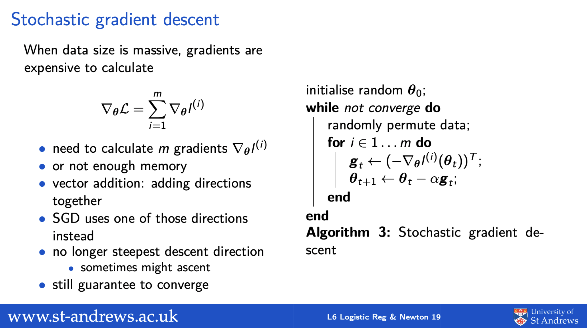

```{r setup, include=FALSE}
library(rgl)
knitr::opts_chunk$set(webgl = hook_webgl,
                      echo = FALSE,
                      fig.align = 'center',
                      message =FALSE,
                      warning = FALSE
                      )
set.seed(0)

```


# Introduction

## Poll result last time

```{r, out.width="80%"}
knitr::include_graphics("./figs/lec6poll.png")
```


## Response

Speed: interrupt me during the lecture if you think I am too fast 

  - very hard for me to gauge the speed
  - w/o visual clue, I do not know where to spend more/less time

\bigskip 

Difficulty: for those who think this course is too easy (there were at least 2 said so in the first poll)

  - minority but still not ideal to you 
  - I will add extra exercises and one relevant ML research paper at the end of each lecture
  - you can also talk to us for further reading/exercises
  - how much you get out from the course is up to you 

  
## Response to comments  

Comment 1: \texttt{"little bit on the Hessian matrix"}

  - **Response**: we will do it today 

Comment 2: \texttt{"need help with all the maths"}

  - **Response**: Kasim and I are running extra lab sessions in even weeks; bring your questions. Can also schedule meetings with me. 
  
## Response to comments

Commen 3: \texttt{"SGD on slide 19 is confusing ... is it the gradient for an individual feature or data point"}

```{r, out.width="75%"}

```

## 

**Response**: Good confusion/question! It worths some further discussions. Remember the total likelihood is
  $$\mathcal{L}(\vv{\theta}) =\sum_{i=1}^m  \underbrace{\dd{y} \log \sigma^{(i)}+(1-\dd{y})\log(1-\sigma^{(i)})}_{\dd{l}(\vv{\theta})}= \sum_{i=1}^m \dd{l}(\vv{\theta}), \;\;\; \text{therefore}$$
  $$\nabla_{\vv{\theta}}\mathcal{L} = \sum_{i=1}^m\nabla_{\vv{\theta}}\dd{l}\;\;\; \text{due to linearity of derivative: } \nabla\sum f_i(x) = \sum \nabla f_i(x)$$

  - total gradient (LHS) is a sum of invidual gradients (of each data point $(i)$)
  - SGD uses $\nabla_{\vv{\theta}}\dd{l}$ instead of $\nabla_{\vv{\theta}}\mathcal{L}$ at each iteration
  - also note the notation for future reference
    - **superscript** $(i)$ (with "**()**") index data points, $y^{(i)}, \Di{x}{i}, \di{l}{i}$ \textit{etc.}
    - **subscript** $j$ index features (w/o brackets) $\vv{\theta}^T\Di{x}{i} = \sum_{j=1}^n \di{x_{j}}{i}\theta_j$


## 

On the other hand, optimise w.r.t features (i.e. descent each $\theta_j$ in turn) is an algorithm called \empha{coordinate descent}

  - not particularly useful for linear regression or logistic regression
    - slower descent than gradient descent, why ?
    - in fact descent by axis aligned directional derivatives (with the relevant partial derivatives entries)
  - useful when $\theta_i, \theta_j$ are coupled though
    - descent is easier for $\theta_2$ if conditional on $\theta_1$ 
    - vice versa
    - numerically stabler than direct optimisation
  - EM (Expectation Maximization) is an example
    - mixture models or Hidden Markov Models (HMMs)
    - we will study it later 


## Plan for today


Learning algorithm:
  
  - demystify Hessian 
  - cases for and against Newton's method
  - practical issues of gradients 

\bigskip

Model:

  - probabilistic view unifies classification and regression
  - fixed basis models: extends linear models to nonlinear modelss
    - but still linear models: only needs to transform your data
    - functional space view 
  
## Vignette: second derivative or curvature

\begin{columns}

\begin{column}{0.7\textwidth}
First, recap on univariate quadratics: $f({x}) = ax^2$
\begin{itemize}
\item multivariate version: $f(\vv{x})= \vv{x}^T\vv{Ax}$
\item gradient: $f'=2ax$ ($\nabla_{\vv{x}}f=2\vv{x}^T\vv{A}$ for multivariate $\vv{x}$)
\item second derivative (Hessian): $f''=2a$  ($\nabla^2_{\vv{x}}f=\vv{H}(f)=2\vv{A}$)
\item btw: effects of adding $bx$ and $c$ terms to $f$? (shifting $f$ to another location; $f''$ doesn't change)
\end{itemize}

So what $f''$ really is ?

\begin{itemize}
\item \empha{curvature}: curviness a curve deviates from straight line
\begin{itemize}
\item large curvature $\rightarrow$ bendy curve
\item small curvature $\rightarrow$ flatter curve 
\end{itemize}
\item \empha{Hessian}? the multivariant version of curvature
\end{itemize}
    
\end{column}

\begin{column}{0.3\textwidth}
```{r, out.width="100%", fig.asp=1.3}
xx <- seq(-5,5, by = 0.01)
yy0 <- 0.05*xx^2
yy1 <-  0.5*xx^2
yy2 <- 2*xx^2
par(mar=c(5,5,0.1,0.1)+.1)
plot(xx, yy1, type="l", col="red", xlab="x", ylab="f(x)", lwd=3, cex.main=2, cex.lab=3)
lines(xx, yy0, col="purple", lwd=3)
lines(xx, yy2, col="blue", lwd=3)
lines(xx, rep(0, length(xx)), col="black", lwd=3)
x0<- -3
text(x0, 0.5*x0^2, "f''= 1", col="red", cex=3.5)
x0<--2
text(x0+1.5, 2*x0^2+2.5, "f''= 4; large curvature", col="blue", cex=3.5)
x0<--4
text(x0+3, 0.05*x0^2+0.8, "f''= 0.1; or small curvature", col="purple", cex=3.5)
```
\end{column}
\end{columns}


## Vignette: directional curvature and Hessian

\begin{columns}

\begin{column}{0.65\textwidth}
Hessian: multivariant curvature. how ?
$$\vv{u}^T\vv{H}\vv{u} \text{ is directional curvature}$$
if $\vv{u}\in R^2$ is a unit vector $||\vv{u}||_2^2=\vv{u}^T\vv{u}=1$ (represents a direction in the input space)
\bigskip

Example: $f(\vv{x}) = x_1^2+x_2^2$ or $\vv{A}= \vv{I}$; Hessian: $$\footnotesize \vv{H}=2\vv{I}=\begin{pmatrix} {2}& 0 \\0 & {2}\end{pmatrix}$$
\begin{itemize}
\item if $\textcolor{red}{\vv{u}_1} =[1,0]^T:$ $\vv{u}_1^T\vv{H}\vv{u}_1=2$ \textcolor{red}{horizontal curvature}
\item if $\textcolor{teal}{\vv{u}_2} =[0,1]^T:$ $\vv{u}_2^T\vv{H}\vv{u}_2=2$ \textcolor{teal}{vertical curvature}
\item actually, curvature is 2 for all directions! (expected as it is a circle)
$\vv{u}^T\vv{H}\vv{u}=2\vv{u}^T\vv{u}=2$
\end{itemize}
\end{column}

\begin{column}{0.35\textwidth}
```{r, out.height="45%",  cache=TRUE, eval=T, include=T}
library(plot3D)
library(ggplot2)
 # library(plotly)
M1 <- mesh(seq(-10, 10, by=0.5),seq(-10, 10, by = 0.5))
M3 <- mesh(0,seq(-10, 10, by = 0.5))
M4 <- mesh(seq(-10, 10, by = 0.5), 0)
 z1 = M1$x ^2 + M1$y^2
 interCurve1 <- M3$x^2 +M3$y^2 
  interCurve2 <- M4$x^2 +M4$y^2 
 surf3D(x=M1$x, y=M1$y, z= z1, colkey = F,
         box = TRUE, bty = "b2",ticktype = "detailed",  phi = 35, theta = 120, facets = F,colvar = z1, xlab="x1", ylab="x2", zlab="f")
 
rect3D(x0 = -11, y0 = 0, z0 = 0, x1 = 11, z1=200, 
       ylim = c(-10, 10), bty = "g", facets = TRUE, 
        col ="#7570B3", alpha=0.3,
       lwd = 2, phi = 20, add=T)

rect3D(x0 = 0, y0 = -11, z0 = 0, y1 = 11, z1=200, 
       xlim = c(-10, 10), bty = "g", facets = TRUE, 
        col ="lightgray", alpha=0.3,
       lwd = 2, phi = 20, add=T)
lines3D(M3$x, M3$y, interCurve1, col="darkgreen", lwd=5 , lty=2,cex=2, add=T)
lines3D(M4$x, M4$y, interCurve2, col="red", lwd=5 , lty=2,cex=2, add=T)
x0 <- c(0, 0, 0)
y0 <- c(0, 0, 0)
z0 <- c(0, 0, 0)
xp <- c(5, 0, 0)
yp <- c(0, 5, 0)
zp <- c(0, 0, 220)
cols <- c("red", "darkgreen", "black")
arrows3D(x0, y0, z0, xp, yp, zp,  col = cols,
         lwd = 2, d = 3, 
          bty ="g", ticktype = "detailed", add=T)
```
```{r, out.height="40%", fig.asp=1, cache=TRUE}
# library(grid)
# x1 <- as.vector(M1$x)
#  x2 <- as.vector(M1$y)
#  zz <- as.vector(z1)
#  bowl<-data.frame(x1, x2, zz)
#  v<- ggplot(bowl, aes(x1, x2, z= zz))
# v+geom_contour()+coord_fixed() + geom_hline(yintercept = 0, linetype="dashed", color = "red")+geom_vline(xintercept = 0,linetype="dashed", color = "darkgreen")
library(shape)
nx=50
ny=50
xCl <- seq(-5, 5, len=nx)
yCl <- seq(-5, 5, len=ny)
g1 <- expand.grid(xCl, yCl)
g1 <- as.matrix(g1)
tmp <- g1[,1]^2+g1[,2]^2
zCl <-matrix(tmp, length(xCl), length(yCl))
par(mar=c(5,5,5,0.1)+.1)
contour(xCl, yCl, zCl, nlevels = 5, xlab = expression(x[1]), 
        ylab = expression(x[2]), xlim=c(-5, 5), ylim = c(-5, 5), cex=2, cex.lab=2, cex.axis=2, labcex=3)
Arrows(c(0,0,0), c(0,0,0), c(1,0, -sqrt(0.5)), c(0,1, -sqrt(0.5)), col=c("red", "darkgreen", "black"), code=2, lwd=5, arr.type="triangle")
# points(t(rstGD2[[1]][2:3,]), pch=20, type="b", col="blue", cex=2.5)
# points(t(rstND2[[1]][2:3,]), pch=20, type="b", col="red", cex=2.5)

```
\end{column}
\end{columns}


## Vignette: directional curvature and Hessian

\begin{columns}

\begin{column}{0.6\textwidth}
Example: $f(\vv{x}) = 4x_1^2+x_2^2$ or $\vv{A}= \begin{bmatrix}4, 0\\0, 1\end{bmatrix}.$ 
Hessian: $\vv{H}=2\begin{bmatrix}4, 0\\0, 1\end{bmatrix}=\begin{bmatrix} {8}& 0 \\0 & {2}\end{bmatrix}$
\begin{itemize}
\item if $\textcolor{red}{\vv{u}_1} =[1,0]^T:$ $\vv{u}_1^T\vv{H}\vv{u}_1=8$ \textcolor{red}{horizontal curvature} (curvy)
\item if $\textcolor{teal}{\vv{u}_2} =[0,1]^T:$ $\vv{u}_2^T\vv{H}\vv{u}_2=2$ \textcolor{teal}{vertical curvature} (less curvy)
\item the curvature changes with directions now
$$\vv{u}^T\vv{H}\vv{u}$$ is not a constant
\end{itemize}
\end{column}

\begin{column}{0.4\textwidth}
```{r, out.height="42%", cache=T, include=T}
library(plot3D)
library(ggplot2)
 # library(plotly)

 M2 <- mesh(seq(-6, 6, by=0.5),seq(-12, 12, by = 0.5))
 M3 <- mesh(0,seq(-12, 12, by = 0.5))
M4 <- mesh(seq(-6, 6, by = 0.5), 0)

 
z2 = 4*(M2$x^2) + M2$y^2
 interCurve1 <- 4*(M3$x^2) +M3$y^2 
  interCurve2 <- 4*(M4$x^2) +M4$y^2 
surf3D(x=M2$x, y=M2$y, z= z2, colkey = F, xlim= c(-10,10),ylim=c(-10,10),
        box = TRUE, bty = "b2", ticktype = "detailed",phi = 35, theta = 120, colvar = z2,facets =F, xlab="x1", ylab="x2", zlab="f")
rect3D(x0 = -11, y0 = 0, z0 = 0, x1 = 11, z1=270, 
       ylim = c(-10, 10), bty = "g", facets = TRUE, 
        col ="#7570B3", alpha=0.3,
       lwd = 2, phi = 20, add=T)

rect3D(x0 = 0, y0 = -11, z0 = 0, y1 = 11, z1=270, 
       xlim = c(-10, 10), bty = "g", facets = TRUE, 
        col ="lightgray", alpha=0.3,
       lwd = 2, phi = 20, add=T)
# rect3D(x0 = -11, y0 = 0, z0 = 0, x1 = 11, z1=200, 
#        ylim = c(-10, 10), bty = "g", facets = TRUE, 
#         col ="#7570B3", alpha=0.5,
#        lwd = 2, phi = 20, add=T)
# 
# rect3D(x0 = 0, y0 = -11, z0 = 0, y1 = 11, z1=200, 
#        xlim = c(-10, 10), bty = "g", facets = TRUE, 
#         col ="#7570B3", alpha=0.5,
#        lwd = 2, phi = 20, add=T)
lines3D(M3$x, M3$y, interCurve1, col="darkgreen", lwd=5 , lty=2,cex=2, add=T)
lines3D(M4$x, M4$y, interCurve2, col="red", lwd=5 , lty=2,cex=2, add=T)

x0 <- c(0, 0, 0)
y0 <- c(0, 0, 0)
z0 <- c(0, 0, 0)
xp <- c(5, 0, 0)
yp <- c(0, 5, 0)
zp <- c(0, 0, 300)
cols <- c("red", "darkgreen", "black")
arrows3D(x0, y0, z0, xp, yp, zp,  col = cols,
         lwd = 2, d = 3, 
          bty ="g", ticktype = "detailed", add=T)
```
```{r, out.height="42%", fig.asp=1.5}
library(plot3D)
library(ggplot2)
library(shape)
nx=500
ny=500
xEllps <- seq(-8, 8, by=0.2)
yEllps <- seq(-12.5, 12.5, by = 0.2)
M2 <- mesh(xEllps,yEllps)
zEllps = 4*(M2$x^2) + M2$y^2
par(mar=c(5,5,5,0.1)+.1)
contour(xEllps, yEllps, zEllps, nlevels = 6, xlab = expression(x[1]), 
        ylab = expression(x[2]), cex=2, cex.lab=2, cex.axis=2, labcex=3)
Arrows(c(0,0,0), c(0,0,0), c(2,0, -sqrt(2)), c(0,2, -sqrt(2)), col=c("red", "darkgreen", "black"), code=2, lwd=3, arr.type="triangle")
```
\end{column}
\end{columns}
<!-- Hessian is multivaraite curvature measure; how though? -->
<!-- $$\vv{u}^T\vv{H}\vv{u} \text{ is directional curvature, if } \vv{u}\in R^2 \text{ is unit vector}$$ -->
<!-- Example: $\vv{A}= \vv{I}$; $f(\vv{x}) = x_1^2+x_2^2$; then Hessian:$\vv{H}=2\vv{A}=\begin{bmatrix} {2}& 0 \\0 & {2}\end{bmatrix}$ -->


## Newton's direction and Hessian


\begin{columns}

\begin{column}{0.75\textwidth}
Newton's method step: $$ \vv{\theta}_{t+1} \leftarrow \vv{\theta}_t -\underbrace{\vv{H}_t^{-1}\vv{g}_t}_{\vv{d}_t}$$

\begin{itemize}
\item Newton's direction: $\vv{d}_t = \vv{H}_t^{-1}\vv{g}_t$
\end{itemize}
 
  
Gradient descent step:  
  $$ \vv{\theta}_{t+1} \leftarrow \vv{\theta}_t -\alpha\vv{g}_t$$
  
Can you explain now
\begin{itemize}
 \item when $\vv{H}_t= \vv{I}$, $\vv{d}_t= \vv{g}_t$ ? what does it imply?
 \item the second case: $\vv{H}_t= \text{diag}(\{8,2\})$? 
\end{itemize}

Moral of the story? 
\begin{itemize}
 \item Shortcuts may not be ideal in long run. (very insightful !) 
\end{itemize}
\end{column}


\begin{column}{0.3\textwidth}
```{r, out.height="35%", fig.asp=1}
library(shape)
par(mar=c(5,5,5,0.1)+.1)
contour(xCl, yCl, zCl, nlevels = 5, xlab = expression(x[1]), 
        ylab = expression(x[2]), xlim=c(-5, 5), ylim = c(-5, 5), cex=2, cex.lab=2, cex.axis=2, labcex=3)
# Arrows(c(0,0,0), c(0,0,0), c(1,0, -sqrt(0.5)), c(0,1, -sqrt(0.5)), col=c("red", "darkgreen", "black"), code=2, lwd=5, arr.type="triangle")
```

```{r, out.height="49%", fig.asp=1.5}
par(mar=c(5,5,5,0.1)+.1)
contour(xEllps, yEllps, zEllps, nlevels = 5, xlab = expression(x[1]), 
        ylab = expression(x[2]), cex=2, cex.lab=2, cex.axis=2, labcex=3)
# Arrows(c(0,0,0), c(0,0,0), c(2,0, -sqrt(2)), c(0,2, -sqrt(2)), col=c("red", "darkgreen", "black"), code=2, lwd=3, arr.type="triangle")
```
\end{column}
\end{columns}


## Newton's method for linear regression

Linear regression $$\nabla_{\vv{\theta}}L= -2(\vv{y}-\vv{X\theta})^T\vv{X};\text{ and the Hessian is: } \nabla^2_{\vv{\theta}}L = 2\vv{X}^T\vv{X}$$

  - constant Hessian matrix: the quadratic approximation is exact
  - Newton step: assume starting from any $\vv{\theta}_0 \in R^n$
  \begin{align*}\vv{\theta}_1 &\leftarrow \vv{\theta}_0 - \underbrace{(2\vv{X}^T\vv{X})^{-1}}_{\vv{H}^{-1}}\underbrace{ (-2\vv{X}^T(\vv{y}-\vv{X\theta}_0) )}_{\vv{g}_0} \\
 \vv{\theta}_1 &\leftarrow \vv{\theta}_0 + (\vv{X}^T\vv{X})^{-1}(\vv{X}^T\vv{y} -\vv{X}^T\vv{X}\vv{\theta}_0) =  \underbrace{(\vv{X}^T\vv{X})^{-1}\vv{X}^T\vv{y}}_{\vv{\theta}_{ls}: \text{ one step optimised}}
  \end{align*}

  - why $\vv{\theta}_{ls}$ is a minimum ? $\vv{H}= 2\vv{X}^T\vv{X}$ is positive definite (similar to univariate function). 
  
\footnotesize  for all $\vv{u}\neq \vv{0}$, $\vv{u}^T\vv{H}\vv{u}=2\underbrace{\vv{u}^T\vv{X}^T}_{\vv{v}^T}\underbrace{\vv{X}\vv{u}}_{\vv{v}}= 2\vv{v}^T\vv{v}>0$  (vector's norm is always positive).
  
  
\footnotesize useful identities to find the Hessian: $\frac{\partial \vv{x}^T \vv{A}}{\partial \vv{x}} = \vv{A}^{T}, \frac{\partial \vv{Ax}}{\partial \vv{x}} = \vv{A}$ 


## Newton's method for logistic regression (code on studres)


```{python, include=F, eval=F}
import autograd.numpy as np
from autograd import grad

# def sigmoid(x):
#     return 0.5 * (np.tanh(x / 2.) + 1)
    
def sigmoid(x):
    return 1.0/(1+np.exp(-1.0*x))

def logistic_predictions(weights, inputs):
    # Outputs probability of a label being true according to logistic model.
    return sigmoid(np.dot(inputs, weights))

def training_loss(weights):
    # Training loss is the negative log-likelihood of the training labels.
    preds = logistic_predictions(weights, inputs)
    label_probabilities = np.log(preds) * targets + np.log((1 - preds)) * (1 - targets)
    return -np.sum(label_probabilities)

# Build a toy dataset.
inputs = np.array([[0.52, 1.12,  0.77],
                   [0.88, -1.08, 0.15],
                   [0.52, 0.06, -1.30],
                   [0.74, -2.49, 1.39]])
targets = np.array([True, True, False, True])

# Define a function that returns gradients of training loss using Autograd.
training_gradient_fun = grad(training_loss)

# Optimize weights using gradient descent.
weights = np.array([0.0, 0.0, 0.0])
print(training_gradient_fun(weights))
print("Initial loss:", training_loss(weights))
for i in range(100):
    weights -= training_gradient_fun(weights) * 0.01

print("Trained loss:", training_loss(weights))
```

```{r, out.width="100%", fig.asp=0.6}
sigmoid <- function(x){
  1/(1+exp(-x))
}


logisGrad <- function(y, X, theta){
  score <- X%*%theta
  mu<-sigmoid(score)
  return(t(X)%*%(y-mu))
}


logisHessian <- function(y, X, theta){
  score <- X%*%theta
  mu <- sigmoid(score)
  dd <- mu*(mu-1)
  return((t(X)%*%diag(as.vector(dd))%*%X))
}


logisNll <- function(y, X, theta){
  score <- X%*%theta
  p <- sigmoid(score)
  -1*sum(y*log(p) + (1-y)*(log(1-p)), na.rm=T)
}

logisticDescent <- function(alpha, iter, X, y, theta0, useLineSearch=F){
  thetas <- matrix(0,nrow = ncol(X), ncol= iter+1)
  thetas[,1] <- theta <- theta0
  nll <- vector(mode = "numeric", length= iter+1)
  nll[1] <- logisNll(y,X, theta)
  for(i in 1:iter){
    g <- logisGrad(y, X, theta)
    if(useLineSearch){
      alphas <- seq(0,0.5, by=0.01)
      nlls<-sapply(alphas, function(x){logisNll(y,X, theta+x*g)})
      alpha <- alphas[which.min(nlls)]
    }
    thetas[,i+1] <- theta <- theta + alpha*g
    nll[i+1] <- logisNll(y,X, theta)
  }
  return(list(thetas, nll))
}


logisNewton <- function(iter, X, y, theta0, tau=0.95, c=0.9, alpha=0.9){
  thetas <- matrix(0,nrow = ncol(X), ncol= iter+1)
  thetas[,1] <- theta <- theta0
  nll <- vector(mode = "numeric", length= iter+1)
  nll[1] <- logisNll(y,X, theta)
  for(i in 1:iter){
    g <- logisGrad(y, X, theta)
    H <- logisHessian(y, X, theta)
    H <- H + diag(0.01, nrow = nrow(H))
    d <- solve(H, g)
    alphas <- seq(0,1, by=0.1)
    nlls<-sapply(alphas, function(x){logisNll(y,X, theta-x*d)})
    alpha <- alphas[which.min(nlls)]
    thetas[,i+1] <- theta <- (theta - alpha*d)
    nll[i+1] <- logisNll(y,X, theta)
  }
  return(list(thetas, nll))
}


library(MASS)
load("./data/lec6_log_data.RData")
X_logis <- as.matrix(lecture9_logis_dat[,1:3])
y_logis <- lecture9_logis_dat$y
# x_1 <- mvrnorm(100, c(-2,-2),  matrix(c(10,7,7,5), ncol = 2, byrow=T))
# x_2 <- mvrnorm(100, c(3, 3),  matrix(c(10,6,6,5), ncol = 2, byrow=T))
# X <-  cbind(1, rbind(x_1, x_2))
# y<- c(rep(0, nrow(x_1)), rep(1, nrow(x_2)))
alpha <- 0.01
iter <- 25

# fix theta0 to its ML estimator
theta0 <- glm(y~X.1+X.2,  data = lecture9_logis_dat, family = binomial())$coefficients[1]

par(mfrow=c(1,2))
par(mar=c(5,5,5,0.1)+.1)
theta0 <- c(theta0 ,-3, 5.2)
rstGD2 <- logisticDescent(alpha, iter, X_logis, y_logis, theta0, useLineSearch = T)
rstGD_NoLineS <- logisticDescent(alpha, iter, X_logis, y_logis, theta0, useLineSearch = F)
rstND2 <- logisNewton(iter, X_logis, y_logis, theta0, alpha = 0.2)
plot(rstND2[[2]][1:10], type="b", xlab="iteration", ylab= "NLL", col="red" ,cex.lab= 1, lwd=3)
lines(rstGD2[[2]][1:10], type="b", col="blue", lwd=3)
lines(rstGD_NoLineS[[2]][1:10], type="b", col="purple", lwd=3)
legend(3, 46, legend=c("GD fixed alpha","GD w. line search","Newton's w. line search"), col=c("purple", "blue", "red"), lty= 2) 


interg <- -0.1384
nx=200
ny=200
xg <- seq(-3, 0.25, len=nx)
yg <- seq(0, 8, len=ny)
g1 <- expand.grid(interg, xg, yg)
g1 <- as.matrix(g1)
tmp <- sapply(1:nrow(g1), function(x) logisNll(y_logis,X_logis, (g1[x,])))
z <-matrix(tmp, length(xg), length(yg))
# contour(xg, yg, z, nlevels = 80, xlab = expression(mu[1]), 
#         ylab = expression(mu[2]))
# 
# points(t(rstGD2[[1]][2:3,]), pch=20, type="b", col="blue")
# points(t(rstND2[[1]][2:3,]), pch=20, type="b", col="red")
# points(t(rstGD_NoLineS[[1]][2:3,]), pch=20, type="b", col="purple")


contour(xg, yg, z, nlevels = 80, xlab = expression(theta[1]), 
        ylab = expression(theta[2]), xlim=c(-3, -0.5), ylim = c(2,6))

points(t(rstGD2[[1]][2:3,]), pch=20, type="b", col="blue")
points(t(rstND2[[1]][2:3,]), pch=20, type="b", col="red")
points(t(rstGD_NoLineS[[1]][2:3,]), pch=20, type="b", col="purple")
```


## A closer look: Newton's method for logistic regression


:::::: {.cols data-latex=""}

::: {.col data-latex="{0.55\textwidth}"}

Gradient descent: zig-zagging

  - consecutive gradients are perpendicular
    - doesn't look so because of plotting ratio
  - zig-zagging in a narrow valley 
  
Newton's method

  - converge faster 
  - does starting point matter? 
  - what if we start from top right corner ?
    - can you envision the cost function from the contour ?


\begin{tcolorbox}[colback=green!5,colframe=green!40!black]
\footnotesize
All code to generate the figs/algorithms on studres
\begin{itemize}
\item in R at the moment; 
\item will translate to Python
\end{itemize}
\end{tcolorbox}
:::

::: {.col data-latex="{0.45\textwidth}"}
```{r, out.width="100%", fig.asp=0.85}
par(mar=c(5,5,5,0.1)+.1)
contour(xg, yg, z, nlevels = 80, xlab = expression(theta[1]), 
        ylab = expression(theta[2]), xlim=c(-3, -1), ylim = c(2.5, 6), cex=2, cex.lab=2, cex.axis=2)

points(t(rstGD2[[1]][2:3,]), pch=20, type="b", col="blue", cex=2.5)
points(t(rstND2[[1]][2:3,]), pch=20, type="b", col="red", cex=2.5)

```

:::

::::::


## Why not everyone is Newton in ML then?

:::::: {.cols data-latex=""}

::: {.col data-latex="{0.70\textwidth}"}

Newton's method can diverge 
  
  - bad quadratic approximation (top fig)
  - might approximate a downward facing bowl (btm fig)
    - finding maximum instead !
    - Newton's direction can either descent or ascent
      - depends on the local approximation 
      - need to check the Hessian for the lost function
      
Remedy
    
  - apply some learning rate $\alpha'<1$ rather than exact Newton step: $\vv{\theta} \leftarrow \vv{\theta}_t -\alpha'\vv{H}_t^{-1}\vv{g}_t$
    - line search to find $\alpha'$: even simply grid search in $(0,1]$: 
    $$\alpha' \leftarrow \argmin_{\alpha} L(\vv{\theta}_t -\alpha \vv{d}_t)$$
  - or use gradient descent first; then Newton's method to speed up at the end


:::


::: {.col data-latex="{0.30\textwidth}"}
```{r, out.width="100%", fig.asp=1}
par(mar=c(5,5,3,0.1)+.1)
xx <- seq(-6, 4, by=0.05)
ff<- expression(0.5*x^2+2*x+exp((-16)*x^2)+2*exp((-5)*x))
fx <- function(x, deriv=0){
  if(deriv == 0){
    return(0.5*x^2+2*x+exp((-16)*x^2)+2*exp((-5)*x))
  }else if(deriv==1){
    return(x+2+exp(-16*x^2)*(-16*x^2)*(-16*2*x)+2*exp(-5*x)*(-5))
  }
}
ffx<-deriv(ff, "x", hessian = T, func=T)
qf <- function(x0, x, FF=fx, FFp=ffx){
  evals <- FFp(x0)
  return(evals[1] + as.vector(attr(evals, "gradient"))*(x-x0) +  attr(evals, "hessian")[1]/2*(x-x0)^2)
}
x0<-1
plot(xx, fx(xx), type = "l", ylim=c(-1, 35), xlim=c(-7,4), lwd=6, ylab="f(x)", xlab="x", cex.lab=2, col="red")
lines(xx, qf(x0,xx), type="l", lty=2, lwd=6, col="blue")

x0grads <- ffx(x0)
segments(x0, x0grads, x0, 0, lty = 2, lwd = 2)

x0_1 <- -as.vector(attr(x0grads, "gradient"))/attr(x0grads, "hessian")[1]+x0
text(x0_1, qf(x0, x0_1), expression(theta[1]), cex=3)
segments(x0_1, ffx(x0_1), x0_1, 0, lty = 2, lwd = 3)
text(x0, x0grads,  expression(theta[0]), cex=3)
text(-3, 25, "bad approximation", cex=3)
```

```{r, out.width="100%"}
knitr::include_graphics("./figs/newtonsMethodNonConvex.pdf")
```
:::
::::::


## Why not everyone is Newton in ML then?


Newton's method is expensive
  
  - Hessian: $n\times n$ derivatives to compute
  - matrix is very expensive to invert in general

\bigskip

Hessian can be impossible to invert
    
  - singular matrix ($\vv{H}^{-1}$ does not exist), similar to divide a number by $0$
  - *regularisation* is useful (adding small constants to diagonal entries)
    - I have used 0.01 in my Newton's algorithm above 
  - stochastic Newton's method ? 
    - inverting a rank one matrix ! ($\dd{\vv{x}}(\dd{\vv{x}})^T$ is rank 1, so singular)
    - in human language: cannot estimate the curvature realiably with only one data
   

<!-- ## -->

# ```{r}
# library(dplyr, warn.conflicts = FALSE)
# norm <- function(x) x / sqrt(sum(x^2))
# Sinv <- solve(S)  ## I know I said not to do this!
# step1 <- function(mu, alpha = 1) {
#         D <- sweep(x, 2, mu, "-")
#         score <- colSums(D) %>% norm
#         mu + alpha * drop(Sinv %*% score)
# }
# steep <- function(mu, n = 10, ...) {
#         results <- vector("list", length = n)
#         for(i in seq_len(n)) {
#                 results[[i]] <- step1(mu, ...)
#                 mu <- results[[i]]
#         }
#         results
# }
# m <- do.call("rbind", steep(c(-5, -2), 8))
# m <- rbind(c(-5, -2), m)
# 
# par(mar = c(4.5, 4.5, 1, 1))
# contour(xg, yg, z, nlevels = 40, xlab = expression(mu[1]), 
#         ylab = expression(mu[2]))
# abline(h = 0, v = 0, lty = 2)
# points(m, pch = 20, type = "b")
<!-- ``` -->


## Quasi-Newton (Newton-like methods)


Quasi-Newton: approximate $\vv{H}_t$ (or even $\vv{H}_t^{-1}$ directly) instead
 
  - some crude Hessian approximations work
    - gradient descent is one! $\vv{H}_t=?$
    - some people use diagonal approximation matrix for $\vv{H}_t$
      - might perform well actually, what does it imply though ?
  - Broyden-Fletcher-Goldfarb-Shanno algorithm (BFGS) is more advanced 
    - approximate Hessian by previous gradients
    - very widely used optimisation routine (Python, R, Matlab, Julia all have its implementation)
    - L-BFGS is limited memory version (do not use all the gradient history)
    

## Gradients in real life

 
\begin{tcolorbox}[colback=green!5,colframe=green!40!black, title=A Burning Question]
\centering how to find out the gradient and Hessian for a new loss $L(\vv{\theta})$?
\end{tcolorbox}

Option 1: manual derivation: a lot of ML researchers do it this way 

\footnotesize 

  - method 1: use vector differentiation identities if you can (more efficient for implementation: vectorisation)
    
\footnotesize   $$\frac{1}{2m}L(\vv{\theta})=\frac{1}{2m}(\vv{y}-\vv{X\theta})^T(\vv{y}-\vv{X\theta}) \Rightarrow  \frac{1}{2m}\nabla_{\vv{\theta}}L=\frac{1}{2m} \underbrace{\nabla_{\vv{y}-\vv{X\theta}}(\vv{y}-\vv{X\theta})^T(\vv{y}-\vv{X\theta})}_{2(\vv{y}-\vv{X\theta})^T}\cdot \underbrace{\nabla_{\vv{\theta}} (\vv{y}-\vv{X\theta})}_{-\vv{X}}$$
  
  - method 2: or break down the total loss as a sum of individual losses; then sum up

\footnotesize  $$\frac{1}{2m}L(\vv{\theta})=\frac{1}{2m}\sum_{i=1}^m \underbrace{(\dd{y}-\vv{\theta}^T\Di{x}{i})^2}_{\dd{l}(\vv{\theta})} \Rightarrow  \nabla_{\vv{\theta}}\dd{l}=2(\dd{y}-\vv{\theta}^T\Di{x}{i})(-\Di{x}{i})^T$$


## Vector calculus shapes

:::::: {.cols data-latex=""}

::: {.col data-latex="{0.62\textwidth}"}
\renewcommand{\arraystretch}{2}
\begin{tabular}{cccc}
& & Scalar & Vector \\
& & $x$ & $\vv{x}$ \\
\hline
Scalar & $y$ & {\Large $\frac{\partial y}{\partial x}$} (scalar) &{\Large $\frac{\partial y}{\partial \vv{x}}$} (row vector)\\
Vector & $\vv{y}$ &{\Large $\frac{\partial \vv{y}}{\partial x}$} (column vector) &{\Large $\frac{\partial \vv{y}}{\partial \vv{x}}$} (matrix)\\
\hline
\end{tabular}
\bigskip

  - notation: vectors are bold font letters, e.g. $\vv{x}$
  - we use numerator notation here (easier to apply chain rule)
    - scalar $y$'s gradient is a row vector, i.e. $\frac{\partial y}{\partial \vv{x}}$
    - vector $\vv{y}$'s derivative is a column vector, i.e. $\frac{\partial \vv{y}}{\partial x}$

:::

::: {.col data-latex="{0.38\textwidth}"}
$$\frac{\partial y}{\partial \vv{x}} = \begin{bmatrix}\frac{\partial y}{\partial {x}_1}& \frac{\partial y}{\partial {x}_2} &\ldots&\frac{\partial y}{\partial {x}_n}\end{bmatrix}$$


$$\footnotesize \frac{\partial \vv{y}}{\partial {x}} = \begin{bmatrix}\frac{\partial y_1}{\partial {x}} \\ \frac{\partial y_2}{\partial {x}} \\\vdots \\ \frac{\partial y_m}{\partial {x}}\end{bmatrix}$$
$$\footnotesize \frac{\partial \vv{y}}{\partial \vv{x}} = \begin{bmatrix}\frac{\partial y_1}{\partial \vv{x}}\\ \frac{\partial y_2}{\partial \vv{x}}\\ \vdots \\ \frac{\partial y_m}{\partial \vv{x}} \end{bmatrix}=  \begin{bmatrix}\frac{\partial y_1}{\partial {x}_1}& \frac{\partial y_1}{\partial {x}_2}& \ldots&\frac{\partial y_1}{\partial {x}_n}\\ \frac{\partial y_2}{\partial {x}_1}& \frac{\partial y_2}{\partial {x}_2}& \ldots&\frac{\partial y_2}{\partial {x}_n}\\ \vdots & \vdots& \ddots &\vdots \\ \frac{\partial y_m}{\partial {x}_1}& \frac{\partial y_m}{\partial {x}_2}& \ldots&\frac{\partial y_m}{\partial {x}_n} \end{bmatrix}$$

:::
::::::

## Check your gradients before use 

Good coding practice apply in ML as well: testing testing testing
  $$\vv{u}^T\nabla_{\vv{\theta}}L(\vv{\theta}) \approx \frac{1}{2\epsilon} (L(\vv{\theta}+\epsilon \vv{u})-L(\vv{\theta}-\epsilon \vv{u}))$$
  
  - check your derivation against the above rule    
  - for some small $\epsilon = 10^{-5}$ etc.
  - $\vv{u}$ can be standard basis directions i.e. $[1,0,0,\ldots]^T, [0,1,0,\ldots]^T$

    


## Gradients in real life

 $$\frac{\partial L(\theta_j)}{\partial \theta_j} \approx \frac{1}{2\epsilon} (L({\theta_j}+\epsilon )-L({\theta_j}-\epsilon ))$$

Option 2: finite difference approximation
  
  - use approximated finite difference instead
  - to evaluate gradient at $\vv{\theta}_t$,
    - choose small $\epsilon = 10^{-5}$ 
    - perturb each dimension in turn to find partial derivatives 
  - not practical for large model (esp. evaluation of $L$ is expensive)
  - subject to truncation error
  - default choice for \texttt{scipy.optimize} method: approximation done for you

 
## Gradients in real life


Option 3: auto differentiation
  
  - an active (and old) research area in computing and ML
    - nobody enjoy doing derivatives by hand ...
  - input: a function; output: gradient function
  - use computation graph (like Neural Nets) to speed up/keep track the calculation
  - backpropagation is one example 
  - a lot of packages out there: autograd in Python, PyTorch etc. 


## Example of autograd for logistic regression
\tiny

```{python,  echo=T, eval=F}
import autograd.numpy as np
from autograd import grad

def logistic_predictions(weights, inputs):
    # Outputs probability of a label being true according to logistic model.
    return sigmoid(np.dot(inputs, weights))

def training_loss(weights):
    # Training loss is the negative log-likelihood of the training labels.
    preds = logistic_predictions(weights, inputs)
    label_probabilities = np.log(preds) * targets + np.log((1 - preds)) * (1 - targets)
    return -np.sum(label_probabilities)

# Define a function that returns gradients of training loss using Autograd.
training_gradient_fun = grad(training_loss)

# Optimize weights using gradient descent.
weights = np.array([0.0, 0.0, 0.0])
print("Initial loss:", training_loss(weights))
for i in range(100):
    weights -= training_gradient_fun(weights) * 0.01

print("Trained loss:", training_loss(weights))
```
  
  
## Towards nonlinear models: regression


::::::{.cols data-latex=""}

::: {.col data-latex="{0.70\textwidth}"}

For linear regression: 

$$ P({y}|{\vv{x}}, \vv{\theta}) = N(\underbrace{f({\vv{x}};\vv{\theta})}_{\vv{\theta}^T{\vv{x}}: \text{ linear}}, \sigma^2) \;\text{or }\; y= \underbrace{f(\vv{x};\vv{\theta})}_{\vv{\theta}^T{\vv{x}}} +\vv{\epsilon}, \;\; \dd{\epsilon}\sim N(0, \sigma^2)$$


The regression function $f$ is assumed linear
  $$f(\vv{x};\vv{\theta}) = \vv{\theta}^T{\vv{x}}$$

  - *i.e.* fitting lines/hyperplanes
  - in real life, a lot of relationships are not linear 
  - and we do not know what $f(\vv{x})$ should look like ! 
  
:::

::: {.col data-latex="{0.30\textwidth}"}
```{r, out.height="42%"}
library(plot3D)
# x, y, z variables
x <- mtcars$wt
y <- mtcars$disp
z <- mtcars$mpg
# Compute the linear regression (z = ax + by + d)
fit <- lm(z ~ x + y)
# predict values on regular xy grid
grid.lines = 26
x.pred <- seq(min(x), max(x), length.out = grid.lines)
y.pred <- seq(min(y), max(y), length.out = grid.lines)
xy <- expand.grid( x = x.pred, y = y.pred)
z.pred <- matrix(predict(fit, newdata = xy), 
                 nrow = grid.lines, ncol = grid.lines)
# fitted points for droplines to surface
fitpoints <- predict(fit)
# scatter plot with regression plane
par(mar=c(3,3,3,0.1)+.1)


scatter3D(x, y, z, pch = 18, cex = 2, 
    theta = 20, phi = 20, ticktype = "detailed",
    xlab = "x1", ylab = "x2", zlab = "f",  colkey = FALSE,
    surf = list(x = x.pred, y = y.pred, z = z.pred,  
    facets = NA, fit = fitpoints))
```

```{r, out.height="45%"}
quaF <- function(x){-(x[1]-5)^2-(x[2]-5)^2+100}
dat<-mvrnorm(50, c(5,5), diag(20, nrow=2))
zz<-sapply(1:nrow(dat), function(x) quaF(dat[x,])+rnorm(1,0,2))
save(dat,zz, file="./data/lec9_nonlinear_reg.RData")
load("./data/lec9_nonlinear_reg.RData")


scatter3D(dat[,1], dat[,2], zz, pch = 18, cex = 2, 
     theta = 20, phi = 20, ticktype = "detailed",
     xlab = "x1", ylab = "x2", zlab = "f",  colkey = FALSE)

M <- mesh(seq(-3, 13, by=0.5),seq(-3, 13, by = 0.5))
z = -(M$x-5) ^2 -(M$y-5)^2+100
surf3D(x=M$x, y=M$y, z= z, colkey = F, 
         bty = "b2",  add=T, facets = NA)
```

:::
::::::


## Towards nonlinear models: classification

::::::{.cols data-latex=""}

::: {.col data-latex="{0.70\textwidth}"}

For logistic regression: 

$$P({y}|{\vv{x}}, \vv{\theta}) = \text{Ber}(\sigma(\underbrace{f(\vv{x};\vv{\theta})}_{\vv{\theta}^T{\vv{x}}: \text{ linear}})= \sigma^{{y}}(1-\sigma)^{(1-{{y}})}$$
To predict the label $y$ for any input $\vv{x}$: 
\begin{align*}\footnotesize
{y}=1\; \text{if }P({{y}}=1|{\vv{x}}, \vv{\theta}) > 0.5\;\;  {y}=0\; \text{if otherwise}
\end{align*}


Note that the **decision boundary** is linear (hyperplane or line)

$$P({{y}}=1|{\vv{x}}, \vv{\theta}) = 0.5 \Rightarrow \vv{\theta}^T\vv{x} =0$$ 

  - $i.e.$ separating data by lines/hyperplanes 
  - in reality, we do know what $f$ should be; plane or a more general surface
:::

::: {.col data-latex="{0.30\textwidth}"}
```{r, out.width="95%"}
# x_1 <- mvrnorm(50, c(-2,-2),  matrix(c(10,2,2,5), ncol = 2, byrow=T))
# x_2 <- mvrnorm(50, c(3, 3),  matrix(c(10,2,1,5), ncol = 2, byrow=T))
# XX <-  cbind(1, rbind(x_1, x_2))
# y<- c(rep(0, nrow(x_1)), rep(1, nrow(x_2)))
load("./data/lec9_logisticDecision.RData")

scatter3D(XX[,2], XX[,3], y, pch = 18, cex = 2, 
     theta = 45, phi = 35, ticktype = "detailed",
     xlab = "x1", ylab = "x2", zlab = "f",  colkey = FALSE, zlim=c(0,1.3))

M <- mesh(seq(min(XX[,2])-1, max(XX[,3])+1, by=0.5),seq(min(XX[,3])-1, max(XX[,3])+1, by = 0.5))
dat_<-data.frame(y=y, X=XX[,2:3])
fit<-glm(y~X.1+X.2, data=dat_, family = "binomial")$coefficients

zz<-sigmoid(fit[2]*M$x + fit[3]*M$y+ fit[1])
surf3D(x=M$x, y=M$y, z= zz, colkey = F, 
         bty = "b2",  add=T, facets = NA)

rect3D(x0 = -10, y0 = -8, z0 = 0.5, x1 = 9, y1=10, 
       ylim = c(-11, 11),xlim=c(-11, 11), bty = "g", facets = T, 
        col ="#7570B3", alpha=0.5,
       lwd = 2, phi = 20, add=T)

x1<- seq(-10,10, by=0.1)
x2 <- (-fit[1]-fit[2]*x1) /fit[3]

lines3D(x1, x2, rep(0.5, length(x1)), col="darkgreen", lwd=5 , lty=3,cex=2, add=T)
```

```{r, out.width="95%", fig.asp=0.85}
par(mar=c(5,5,5,0.1)+.1)
plot(XX[1:50, 2], XX[1:50, 3], pch=1, col="blue", xlim=c(min(XX[,2]), max(XX[,2])), ylim=c(min(XX[,3]), max(XX[,3])), xlab=expression(x[1]), ylab=expression(x[2]), cex=3, cex.lab=2.5, cex.axis=2)
points(XX[51:100, 2], XX[51:100, 3], pch=8, col="red", cex=3)
x1<- seq(-12, 10, by=0.5)
y1<- (-fit[1]-x1*fit[2])/fit[3]
lines(x1, y1, lwd=5, lty=2, col="darkgreen")
text(-7.5, 4.75, "P=0.5", cex=3)
# contour(xg, yg, z, nlevels = 80, xlab = expression(mu[1]), 
#         ylab = expression(mu[2]))
# 
# points(t(rstGD2[[1]][2:3,]), pch=20, type="b", col="blue")
# points(t(rstND2[[1]][2:3,]), pch=20, type="b", col="red")
# points(t(rstGD_NoLineS[[1]][2:3,]), pch=20, type="b", col="purple")

```

:::
::::::

## Nonlinear classification data
::::::{.cols data-latex=""}

::: {.col data-latex="{0.70\textwidth}"}
What if your data looks like this ?
  
  - no linear descision boudary or $f(\vv{x};\vv{\theta}) = \vv{\theta}^T\vv{x}$ seems making much sense
  - but a non-linear boundary makes more sense 
    - the classification rule is actually $||\vv{x}||_2^2 = x_1^2+x_2^2\leq 1$
    - distance to $\vv{0}$ is less than 1
    - the boundary is a circle 
    - \footnotesize I know it because I generated the data
:::

::: {.col data-latex="{0.30\textwidth}"}
```{r, out.height="45%", fig.asp=1}
par(mar=c(5,5,5,0.1)+.1)
# xx <-runif(400, -1.8,1.8)
# xx <- cbind(xx[1:200], xx[201:400])
# y <- rep(1,nrow(xx));
# y[(xx[,1]^2+xx[,2]^2)<1 ] <- 0
load("./data/lec9_nonlinear_class.RData")
plot(xx[y==0, 1], xx[y==0, 2], pch=8, col="blue", xlim=c(min(xx[,1])-0.5, max(xx[,1])+0.5), ylim=c(min(xx[,2])-0.5, max(xx[,2])+0.5), xlab=expression(x[1]), ylab=expression(x[2]), cex=5, cex.lab=2.5, cex.axis=2)
points(xx[y==1, 1], xx[y==1, 2], pch=1, col="red", cex=5)
x1<- seq(-2, 2, by=0.5)
y1<- x1*1+1
lines(x1, y1, lwd=5, lty=2, col="darkgreen")
text(1.3, 2, "???", cex=3, col="darkgreen")
```

```{r, out.height="45%", fig.asp=1}
library(plotrix)
par(mar=c(5,5,5,0.1)+.1)
# xx <-runif(400, -1.8,1.8)
# xx <- cbind(xx[1:200], xx[201:400])
# y <- rep(1,nrow(xx));
# y[(xx[,1]^2+xx[,2]^2)<1 ] <- 0
load("./data/lec9_nonlinear_class.RData")
plot(xx[y==0, 1], xx[y==0, 2], pch=8, col="blue", xlim=c(min(xx[,1])-0.5, max(xx[,1])+0.5), ylim=c(min(xx[,2])-0.5, max(xx[,2])+0.5), xlab=expression(x[1]), ylab=expression(x[2]), cex=5, cex.lab=2.5, cex.axis=2)
points(xx[y==1, 1], xx[y==1, 2], pch=1, col="red", cex=5)
 draw.circle(0,0,c(1),border="darkgreen",lty=1,lwd=5)
# x1<- seq(-12, 10, by=0.5)
# y1<- (-fit[1]-x1*fit[2])/fit[3]
# lines(x1, y1, lwd=5, lty=2, col="darkgreen")
# text(-7.5, 4.75, "P=0.5", cex=3)
```
:::
::::::

## Nonlinear model: polynomial model
```{r, figures-side, fig.show="hold", out.height="40%"}
# quaF <- function(x){-(x[1]-5)^2-(x[2]-5)^2+10}
# dat<-mvrnorm(50, c(5,5), diag(20, nrow=2))
# zz<-sapply(1:nrow(dat), function(x) quaF(dat[x,])+rnorm(1,0,2))
load("./data/lec9_nonlinear_reg.RData")
scatter3D(dat[,1], dat[,2], zz, pch = 18, cex = 2, 
     theta = 20, phi = 20, ticktype = "detailed",
     xlab = "x1", ylab = "x2", zlab = "f",  colkey = FALSE)

M <- mesh(seq(-2, 11.5, by=0.5),seq(-2, 12, by = 0.5))
z = -(M$x-5) ^2 -(M$y-5)^2+100
surf3D(x=M$x, y=M$y, z= z, colkey = F, 
         bty = "b2",  add=T, facets = NA)

load("./data/lec9_nonlinear_class.RData")

scatter3D(xx[,1], xx[,2], y, pch = 18, cex = 2, 
     theta = 20, phi = 30, ticktype = "detailed",
     xlab = "x1", ylab = "x2", zlab = "f",  colkey = FALSE)

M <- mesh(seq(-2, 2, by=0.1),seq(-2, 2, by = 0.1))
z = sigmoid(5*(M$x)^2 + 5*(M$y)^2-5)
surf3D(x=M$x, y=M$y, z= z, colkey = F, 
         bty = "b2",  add=T, facets = NA)

```
Both models are actually 2nd order polynomial:
\footnotesize$$f(\vv{x};\vv{\beta}) = \beta_0+ \beta_1x_1+ \beta_2x_2 +\beta_3x_1x_2+\beta_4x_1^2 +\beta_5x_2^2 =\sum_{k=0}^5 \beta_j \phi_j(\vv{x})=\vv{\beta}^T\vv{\phi}(\vv{x})$$

\normalsize 
  - where  $$\footnotesize \vv{\phi}(\vv{x}) = [\underbrace{1}_{\phi_0(\vv{x})}, \underbrace{x_1}_{\phi_1(\vv{x})}, \underbrace{x_2}_{\phi_2(\vv{x})}, \underbrace{x_1x_2}_{\phi_3(\vv{x})}, \underbrace{x_1^2}_{\phi_4(\vv{x})}, \underbrace{x_2^2}_{\phi_5(\vv{x})}]^T$$ 
  
- it expands $\vv{x}=[1, x_1, x_2]^T$ to a larger vector 

  <!-- - $\vv{\phi}$ is called basis function: it takes in  -->
  <!-- - regression model above: $f(\vv{x}) = 100- (x_1-5)^2-(x_2-5)^2$ -->
  <!-- - classification model above: $f(\vv{x}) = 5x_1^2+5x_2^2-5$; the decision boundary is $x_1^2+x_2^2=1$: a circle -->
  

## Nonlinear response from linear model

Note that you get a free nonlinear model by transforming the input $\vv{X}$
$$\footnotesize \vv{X} = \begin{bmatrix} 1& \di{x}{1}_1& \di{x}{1}_2 \\
1& \di{x}{2}_1& \di{x}{2}_2 \\
\vdots& \vdots& \vdots \\
1 &  \di{x}{m}_1& \di{x}{m}_2
\end{bmatrix} \Rightarrow \vv{\Phi} =\begin{bmatrix} \vv{\phi}(\Di{x}{1}) \\
\vv{\phi}(\Di{x}{2}) \\
\vdots \\
\vv{\phi}(\Di{x}{m})
\end{bmatrix} = \begin{bmatrix} 1& \di{x}{1}_1& \di{x}{1}_2& \di{x}{1}_1 \di{x}{1}_2& (\di{x}{1}_1)^2 & (\di{x}{1}_2)^2\\
1& \di{x}{2}_1& \di{x}{2}_2& \di{x}{2}_1 \di{x}{2}_2& (\di{x}{2}_1)^2 & (\di{x}{2}_2)^2\\
\vdots& \vdots& \vdots & \vdots & \vdots & \vdots\\
1& \di{x}{m}_1& \di{x}{m}_2& \di{x}{m}_1 \di{x}{m}_2& (\di{x}{m}_1)^2 & (\di{x}{m}_2)^2\\
\end{bmatrix}$$

  - remember superscript $(i)$ index data samples; and  subscript index features 
  - $\vv{\Phi}$ is a $m\times 6$ matrix
  - for higher order polynormial, the new design matrix just gets wider
  
\normalsize

The expanded model for regression is $$\vv{y} = \vv{\Phi}\vv{\beta} + \vv{\epsilon}$$
  
  - still a linear model w.r.t $\vv{\phi}$, the expanded new features
  - all existing results apply: gradient descent, normal equation (replace $\vv{X}$ with $\vv{\Phi}$)
  $$\vv{\beta}_{ls} =(\vv{\Phi}^T\vv{\Phi})^{-1}\vv{\Phi}^T\vv{y}$$


## General basis function expansion

It turns out $\vv{\phi}{(\vv{x})}$ can take a wide range of forms

  - each $\phi_k(\vv{x})$ is a $R^n\rightarrow R$ transformation; so $\vv{\phi}$ is a $R^n\rightarrow R^p$ transformation
    - previous example: $n=3$, $p=6$
  - obviously, if $\vv{\phi}(\vv{x}) = \vv{I}\vv{x}$, we recover ordinary linear regression
  - previous case: $\phi_k(\vv{x}) = x_j^2$, $x_jx_{j'}$, $x_j$, or 1, for 2-nd order polynormial
  - 3-rd order polynomial will add $\phi_k(\vv{x}) = x_j^3$, $x_jx_{j'}x_{j''}$ on top
  - $\phi_k(\vv{x}) = \log(x_j), \sqrt{x_j}, \sigma(x_j+\mu)\; (\text{sigmoid function}), \ldots$
  - radial basis function: $\phi_k(\vv{x}) = \exp\left (-\frac{||\vv{x}-\vv{\mu}_k||_2^2}{2s^2}\right )$

```{r, out.height="38%", fig.show="hold"}
knitr::include_graphics("./figs/Figure3_1a.pdf")
knitr::include_graphics("./figs/Figure3_1b.pdf")
knitr::include_graphics("./figs/Figure3_1c.pdf")
```


## Fixed basis models

Regression function is assumed as $$f(\vv{x};\vv{\beta})=\sum_{k=0}^{p-1} {\beta}_k \vv{\phi}_k(\vv{x})$$

  - this is called fixed basis model in ML
    - it is called fixed basis because the basis have to be manually chosen for training 
    - we will see adaptive basis model later (i.e. neural networks)
  - we will assume linear models are just fixed basis models from now on
  
## * A bit on abstract vector space: why called basis 

\small 
In abstract vector space, a function can be a vector as well, say $\phi_k(\vv{x})$

$$f(\vv{x};\vv{\beta})=\sum_{k=0}^{p-1} {\beta}_k {\phi}_k(\vv{x})$$
  
  - $f$ (our unknown regression function) is represented a linear combination of some basis vectors $\phi_0,\phi_1,\ldots$
  - e.g. 
  $$f(x) = \beta_0 +\beta_1x$$ can be viewed as a linear combination of two basis vectors: $\phi_0(x)= 1$ and $\phi_1(x) =x$ 
  $$f(x) = \beta_0 \phi_0(x)+\beta_1\phi_1(x)$$
  - so for ordinary linear regression, we are finding the a representation of $f$ only in the subspace $\text{span}(\{\phi_0(x), \phi_1(x)\})$
  - something significant is all those things we learnt in linear algebra can still be applied (mostly) e.g. projection of $f$ to a subspace
  
  
## Suggested reading

- MLAPP 7.1-7.3; 8.1-8.3
- ESL 5.1-5.3
- Pattern recognition and ML by Chris Bishop 3.1, 4.3, *5.4 (Hessian matrix)
- \*relevant ML research paper: Automatic Differentiation
in Machine Learning: a Survey, Baydin et al, Journal of Machine Learning Research \url{https://arxiv.org/pdf/1502.05767.pdf}


## Exercises for today's lecture

\footnotesize 

You can discuss your solution with me in extra lab session or with your classmates.

1. Find the Hessian for the linear regression's loss function by applying identities

2. Consider logistic regression's loss function (or negative log likelihood). Does the loss function has a maximum or minimum? 

3. Why we cannot find the minimum for logistic regression in one step like linear regression ?

##

\footnotesize
4. (Adapted from a past exam of ML at Cambridge and it practices your skill of applying MLE) To perform linear regression with noisy data, you find the normal assumption that the noise is zero mean Gaussian does not work well. Your colleague at work suggests you try \textit{Cauchy density} $$p(x; \alpha, \beta) = \frac{1}{\beta\pi} \left(\frac{\beta^2}{(x-\alpha)^2+\beta^2}\right)$$ (having parameters $\alpha$ and $\beta>0$) instead.

    - denote the parameters of the regression model by $\vv{\theta}$; given a set of $m$ samples, each consisting of a $n$- dimensional vector $\vv{x}$ and corresponding target $y$. Find an expression for the log likleihood $p(\vv{y}|\vv{\theta})$ where $\vv{y}^T=(y_1,\ldots, y_m)$. State any assumption you make.
    - derive a learning algorithm for the model; (try implementing it and see whether it works)
      - if you do not like doing derivatives manually, you should use autograd package instead (you at least need to know one way or the other!)
    - is your colleague right ? why Cauchy makes sense when data is noisy ? (you may need to plot the density of a Cauchy and see its difference to Gaussian.)

