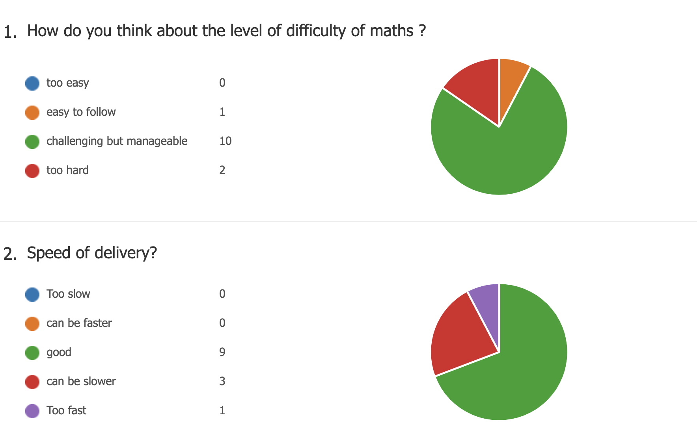

```{r setup, include=FALSE}
library(rgl)
knitr::opts_chunk$set(webgl = hook_webgl,
                      echo = FALSE,
                      fig.align = 'center',
                      message =FALSE,
                      warning = FALSE
                      )
set.seed(0)

```


# Introduction

## Response to last poll

```{r, out.width="80%"}

```


## Maths 

Do I need to read all the maths on the slides \textit{during lecture} ?

  - \textbf{NO}! follow the logic is more important
  - \textit{esp.} when I jump slides (most likely technical details)
    - e.g. "take the derivative and set it to zero", just believe me for the time being
    - might left there for your reference (I will make sure it is clear)
  - catch the key message
    - the conclusion: e.g. $MLE$ leads to least square

BUT \textbf{YES} verify them after the lecture step by step 
  
  - no way to learn CS or maths modules just by attending lectures

Feel free to stop me during the lecture

  - when you cannot follow the logic: highly likely I have messed something up
  - when the notation is confusing: still possibly my bad
    - I used $\sigma$ for both sigmoid and variance ($\sigma^2$) of Gaussian
    - or like $\prod p_i^{I(x=i)}$, if you do not know what $I$ does..
    
